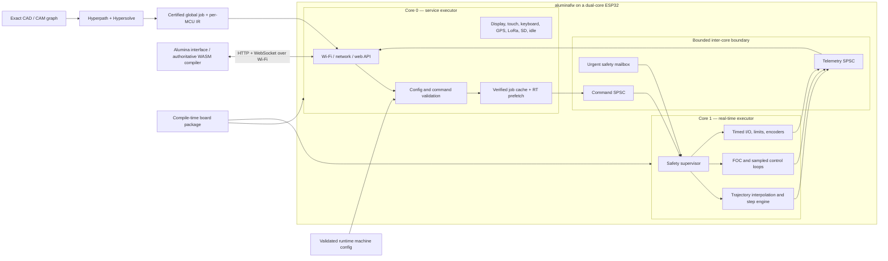
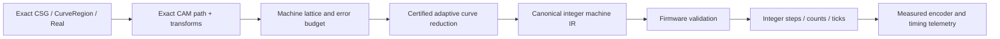

# Target architecture

## System shape



The service core is the only network-facing and persistent-media-facing trust
boundary. The real-time core does not parse HTTP, JSON, YAML, user strings,
storage data, G-code, source geometry, or graph files. It receives only
already validated, bounded binary frames whose exact schema version,
configuration digest, sequence, and time range are known. A schema mismatch is
an update error, not a request to enter a compatibility mode.

## Execution domains

### Core 0: service executor

Owns:

- `esp-radio`, Wi-Fi provisioning/AP/STA, `embassy-net`, DHCP/DNS as needed;
- the HTTP/WebSocket server, request parsing, authentication, static web assets,
  Wi-Fi scanning/association, and command admission;
- configuration parsing, schema validation, persistence, signed OTA staging, and
  SD access plus verified job-block prefetch;
- telemetry encoding, decimation, logging, diagnostics, clock-heartbeat capture,
  and UI/device time-model samples;
- T-Deck display, touch, keyboard, battery charger, GPS, and LoRa tasks unless a
  particular signal is deliberately assigned to real-time control;
- future non-real-time relay/industrial UI buses and general idle/background
  maintenance; and
- the only general allocator, if an allocator is retained at all.

Does not:

- toggle motion or power-stage outputs directly;
- hold locks needed by the real-time core;
- write flash/NVS or perform OTA while the device is armed; or
- enqueue unbounded work.

### Core 1: real-time executor

Owns:

- the monotonic machine clock and scheduled-event dispatcher;
- safety state, hard limits, emergency stop, enable chains, deadman/watchdogs,
  fault latching, and safe output transitions;
- certified-schedule consumption, local constraint checks, jerk/finite-difference
  interpolation, step pulse engines, homing, probing, and bounded hold/stop
  fallback;
- MCPWM/LEDC/RMT/I²S/DMA channels assigned to motion or power control;
- PWM-synchronized ADC/current sampling, FOC transforms and control loops,
  encoders/PCNT/Hall inputs, and servo following-error logic;
- timed ADC/digital/PWM operations deployed from a validated control graph; and
- fixed-rate telemetry sampling into a bounded queue.

Does not:

- allocate after arming;
- read files or network sockets;
- format strings or perform general logging in time-critical paths;
- access PSRAM or flash-resident code/data from an IRAM-safe critical path; or
- wait on a service-core mutex or shared peripheral bus.

### Executor and interrupt construction

Use the ESP Rust runtime’s supported second-core startup and one Embassy executor
per core. There is no task migration or stealing. Async driver construction and
interrupt binding happen on the owning core, because ESP async driver instances
and interrupt handlers are commonly core-affine and not `Send`.

Core 1 may use a high-priority interrupt executor or direct IRAM-safe interrupt
handlers for the innermost pulse/current loops, while retaining Embassy tasks for
slower real-time coordination. “Embassy-based” does not mean every sample is an
ordinary cooperative task: the hardware-timed ISR/DMA layer remains explicit.

### Implemented M3 network foundation

The initial adapter initializes the radio and its scheduler-backed allocation on
core 0 before starting core 1. It keeps the Wi-Fi controller, AP device, station
device, `embassy-net` stack, DHCP server, HTTP server, and all socket buffers on
the service side. Firmware reserves a 64 KiB reclaimed-memory heap plus a 36 KiB
ordinary heap for the vendor radio/runtime; the real-time core still performs no
general allocation after arming.

The recovery AP is `192.168.4.1/24`, admits at most four clients, and offers only
`.100` through `.103`. HTTP starts with two handlers, exact route matching,
fixed headers/socket buffers, per-I/O and per-request timeouts, no-store
responses, and a restrictive bootstrap-page CSP. The first linked image exposes
only `/`, `/api/v1/identity`, `/api/v1/health`, and `/api/v1/network` as read-only
bootstrap endpoints. Unknown routes are 404 and mutation methods are 405; there
are no legacy aliases.

This foundation deliberately does not yet claim AP+STA coexistence, scanning,
association, authentication, WebSocket streaming, asset bundles, storage
mutation, or request-rate admission. The controller and station device stay
owned by core 0 for those additions. The selected DHCP adapter may need a
link-layer workaround for clients which clear the DHCP broadcast flag before
they have an IP address, because `embassy-net` cannot necessarily unicast to
their not-yet-learned MAC address; physical-client qualification is mandatory.

The next admission layer keeps authentication policy in portable `alumina-net`
and native service dispatch in portable `alumina-service`. The HTTP task reads at
most 1,148 exact body bytes, verifies a boot-nonce/counter HMAC and replay/rate
policy, then copies one request into a single-slot same-executor bridge. The sole
core-0 service task owns `StorageServiceState`, decodes the frame, and returns a
correlated fixed response. One transaction mutex serializes the initial mutation
surface; transaction IDs prevent a response produced after HTTP timeout
cancellation from satisfying a later request. These same-executor locks do not
mask interrupts on core 1.

`GET /api/v1/storage` returns an authenticated, response-signed JSON status. An
identified but unprovisioned card is `detached`; failed identification is
`faulted`. Status distinguishes physical blocks, selected raw-region blocks,
locator generation/media ID, degraded locator/anchor recovery, and upload versus
provision mutation availability.
`POST /api/v1/storage` accepts only a complete native frame and response-signs
the native result. It checks outer/operation lengths, directions, storage-plan
structure, chunk size, and chunk SHA-256. Boot reads the two fixed hashed
provisioning locators at blocks 2046–2047 and mounts only the exact selected raw
region after its media identity and complete committed log replay. Foreign
locator bytes remain detached; damaged recognizable locators fail closed.
`StorageProvision` is the only formatter: its 112-byte canonical request binds
card capacity, expected generation/current ID, exact new interval, fresh ID, and
explicit untrusted-locator recovery intent under SHA-256. The service safety
gate still forbids every format/upload while booting, armed, energized, or
serving real-time work, and no in-RAM success acknowledgement substitutes for
durable storage.

### Cross-core messages

Use independent channels so telemetry or bulk-work pressure cannot delay a stop
request:

| Channel | Direction | Semantics |
| --- | --- | --- |
| `CommandQueue<N>` | service to RT | Ordered, bounded, sequence-numbered configuration and lifecycle control |
| `WorkQueue<N>` | service to RT | Inline-owned canonical 512-byte machine blocks; fixed ring capacity is the producer credit count |
| `UrgentMailbox` | service/safety ISR to RT | Latest-value stop/hold/reset request; never waits behind motion data |
| `TelemetryQueue<N>` | RT to service | Loss-aware snapshots/events; may decimate non-fault samples, never fault edges |

Frames use explicit audited little-endian encoding; Rust `repr(C)` layout is
never treated as wire bytes. A frame carries protocol version, kind, length,
sequence, machine clock/deadline, active configuration digest, payload, and
integrity check where appropriate.
Variable-sized jobs are a nonempty concatenation of canonical 512-byte execution
blocks. The implemented work channel stores those blocks inline in a statically
allocated ring and exposes its free slots as credits. Sending moves a non-`Copy`,
non-`Clone` block into the ring; receiving moves it into core-1-local ownership.
No frame contains a reference, pointer, `String`, `Vec`, trait object, SD address,
or cross-core peripheral handle. The current depth of eight reserves 4,096
payload bytes but is a compile-time foundation, not a qualified time horizon.

Storage chunks and execution blocks are intentionally different boundaries. A
core-0 `PartitionAssembler` accepts arbitrary verified storage slices and emits
at most one complete work block per call. Both cores maintain independent stream
validators over stream/capability/configuration identities, sequence, exact
relative-tick continuity, previous-block digest, per-segment bounds, and cumulative
lattice displacement. A storage-valid but machine-IR-invalid object never gains
a work-queue credit.

Cached blocks use a `StreamTick` newtype, while hardware timestamps use
`DeviceCycle`. A later commit installs the future local device epoch and checked
addition maps each relative tick to hardware time. The types intentionally
prevent a cached schedule from arming itself or being confused with an absolute
counter sample.

### ESP32 flash/cache constraint

Dual cores do not provide full isolation: flash write/erase operations can
disable caches and block the other CPU. The real-time guarantee therefore also
requires:

- the entire critical call graph in IRAM and constants/state in internal DRAM;
- internal-SRAM DMA buffers and queues, never PSRAM, for the active horizon;
- hardware-timed buffering deep enough to cover measured interrupt latency;
- no flash/NVS/update writes while configured as `Armed`, `Running`, or `Hold`;
- static web assets and code reads admitted during motion only after worst-case
  cache tests on each board/chip; and
- a board-specific deadline and buffer-depth report in release evidence.

### Single-core targets

ESP32-C3/C6 and other single-core variants cannot satisfy the requested physical
core split. They are out of scope: board selection fails before firmware
compilation and no cooperative or degraded motion profile is maintained. Chip
metadata may identify such a target as `unsupported-core-count` so the coverage
ledger explains the rejection.

## Proposed workspace

```text
aluminafw/
├── Cargo.toml                   # virtual workspace, shared lints/dependencies
├── rust-toolchain.toml
├── LICENSE-MIT
├── LICENSE-APACHE
├── LICENSES/                    # imported notices and exceptions
├── THIRD_PARTY.toml             # source URL, revision, license, modifications
├── firmware/
│   ├── Cargo.toml
│   ├── build.rs                 # exactly-one-board checks, metadata/assets
│   └── src/main.rs              # executors and selected board composition root
├── boards/
│   ├── registry.toml
│   ├── mks-tinybee/
│   │   ├── board.toml           # facts/capabilities/aliases/safe states
│   │   └── src/lib.rs           # typed esp-hal resource construction
│   ├── t-deck-pro/
│   ├── mks-esp32-foc-v1/
│   ├── t-lora-pager/            # late metadata/build stub first
│   └── ...
├── crates/
│   ├── alumina-protocol/        # no_std shared wire types and schema versions
│   ├── alumina-board/           # board capability and allocation contracts
│   ├── alumina-config/          # transactional resource/machine config
│   ├── alumina-runtime/         # core startup, queues, clocks, budgets
│   ├── alumina-clock/           # cycle sampling and scheduled starts
│   ├── alumina-safety/          # state machine and safe-output policies
│   ├── alumina-motion/          # integer schedule checks, RT interpolation/hold
│   ├── alumina-step/            # direct/RMT/I2S pulse backends
│   ├── alumina-foc/             # motor/sensor/driver/current/control layers
│   ├── alumina-control-ir/      # deterministic deployed graph subset
│   ├── alumina-net/             # embassy-net web/API implementation
│   ├── alumina-storage/         # immutable SD cache and RT prefetch
│   ├── alumina-sim/             # virtual cache, power loss, service/RT timing
│   ├── alumina-machine-ir/      # certified integer toolpath format/validator
│   └── alumina-sim/             # host simulation and trace/replay
├── drivers/                     # imported T-Deck and generic async drivers
│   ├── embedded-bus-async/
│   ├── sx126x-async-rs/
│   └── t-deck-pro-*/
├── web-assets/
│   ├── manifest.toml            # expected interface revision and digests
│   └── generated/               # ignored build output
├── schemas/                     # board, config, graph IR, machine IR, API
├── board-assets/                # licensed photos, hotspot maps, provenance
├── xtask/                       # build/flash/monitor/assets/schema/HIL commands
├── tests/
│   ├── fixtures/
│   ├── property/
│   ├── replay/
│   └── hil/
└── docs/
```

Keep crates narrow enough for host testing. Only `firmware`, board packages, and
hardware backends should depend directly on chip-specific `esp-hal` types.
Protocol, configuration validation, safety transitions, integer motion
validation/interpolation, graph IR, machine IR, and simulation remain portable
`no_std` crates with optional `std` test features. Exact global path planning
lives with the authoritative interface/CAM library.

## Board and machine model

There are two layers because compile-time chip facts and runtime machine choices
have different failure modes.

### Compile-time board package

A package supplies:

- board ID/revision and ESP chip/target;
- flash, internal RAM, PSRAM, partition, clock, and core capabilities;
- physical GPIO and virtual resource namespaces;
- reserved/strapping/input-only pins and electrical warnings;
- bus wiring, chip selects/addresses, shared-bus relationships, DMA channels, and
  interrupt affinity;
- named devices fitted on the PCB;
- supported timed-output engines and their limits;
- aliases matching silkscreen and common upstream configurations;
- boot, unconfigured, fault, and watchdog safe states;
- licensed annotated board photographs and normalized connector/resource
  hotspot maps; and
- static motor-driver, PWM, ADC/current-sense, storage, and clock capabilities
  needed by the authoritative UI compiler.

The small Rust composition root consumes `esp_hal::Peripherals` exactly once,
constructs owned resources, and returns separate `ServiceResources` and
`RealtimeResources`. Adding a board should not add `cfg` branches throughout
motion, network, or application code.

Build UX:

```text
cargo xtask board list
cargo xtask board check mks-tinybee
cargo xtask build --board mks-tinybee --profile release
cargo xtask flash --board t-deck-pro
cargo xtask capabilities --board mks-tinybee --json
```

`xtask` maps the selected board to the chip target, Cargo features, linker
scripts, partition table, web bundle, and CI/HIL suite. Direct ambiguous builds
fail with a useful error.

### Runtime machine configuration

A configuration maps names such as `axis.x.step`, `spindle.pwm`, `probe`,
`heater.bed`, `serial.modbus`, or `control.loop_1.timer` to resources advertised
by the board. It selects kinematics, limits, driver mode, microstepping, motor
and encoder facts, rational scale/calibration, measurement uncertainty,
qualified motion/control limits, process policies, safety chains, and
peripherals, but cannot invent a capability.

Configuration lifecycle:

1. Parse on core 0 with strict size/depth limits.
2. Resolve aliases to stable typed `ResourceId` values.
3. Check electrical mode, timing, frequency, DMA/interrupt, bus-sharing, and
   ownership constraints.
4. Check duplicate claims and combinations forbidden by the board package.
5. Construct an inactive configuration in fixed storage.
6. Send a bounded description to core 1 for independent real-time validation.
7. Commit on both cores using a canonical digest and enter `Configured`.
8. Persist only while safe and idle.
9. Export exact values, bounded measurements, capability/configuration digests,
   and timing limits needed by the UI to select CAM precision.

FluidNC configuration is research material for board facts, not a supported
runtime format. Alumina uses one native schema and reports unsupported boards or
resources directly.

## Resource abstraction

Avoid a single integer “pin” namespace. Use a stable tagged ID plus a capability
record:

```rust
enum ResourceId {
    Gpio { bank: u8, index: u8 },
    I2sOut { engine: u8, bit: u8 },
    AdcChannel { unit: u8, channel: u8 },
    PwmChannel { engine: PwmEngine, unit: u8, channel: u8 },
    Timer { group: u8, index: u8 },
    RmtChannel(u8),
    PcntUnit(u8),
    I2cBus(u8),
    SpiBus(u8),
    Uart(u8),
    Twai(u8),
    Device(DeviceId),
}
```

The illustrative shape is not a frozen Rust API. The important properties are:
typed namespaces, stable serialization, alias resolution outside real-time code,
and enough metadata to reject impossible operations. A TinyBee alias such as
`IO129` resolves to `I2sOut { engine: 0, bit: 1 }`; it never masquerades as
`Gpio(129)`.

Capability families are staged:

- digital: input, output, open-drain, interrupt, debounce, safety input;
- sampled: ADC, DAC where available, pulse count, encoder, capture/compare;
- timed output: LEDC, MCPWM, RMT, I²S shift stream/static, generic timers;
- buses: I²C, SPI, UART/RS-485, TWAI/CAN, USB, Ethernet, SD/SDMMC;
- radio/network: Wi-Fi, BLE, ESP-NOW, LoRa/GPS devices;
- board devices: displays, touch, keyboards, chargers, expanders, relays; and
- control: stepper axes, servo axes, heaters, spindles, fans, probes, safety.

Supporting “all ESP32 peripherals and protocols” means the schema and UI can
represent these families and new implementations plug into the same lifecycle.
It does not mean every chip peripheral is production-ready in the first release.

## Protocol and web API

### Shared protocol crate

`alumina-protocol` is `no_std`, explicitly versioned, and usable by firmware,
host simulator, and interface/WASM. Firmware and embedded UI ship as one schema
set; differing versions refuse mutation and request a coordinated update. Prefer
fixed discriminants, fixed maxima, and an encoding
such as Postcard only after worst-case size and decode-time measurement. Generate
JSON Schema/TypeScript descriptions for discovery/configuration without creating
a second handwritten model.

Every control request carries:

- protocol/schema version;
- board capability digest and active configuration digest;
- client/job/sequence identity;
- desired machine time or deadline where scheduled;
- idempotency/retry semantics; and
- bounded payload length.

### API surface

Proposed routes:

| Route | Purpose |
| --- | --- |
| `GET /api/v1/identity` | board, firmware, boot, security, schema versions |
| `GET /api/v1/capabilities` | resources, devices, limits, clock domains, safety features |
| `GET/PUT /api/v1/config` | inspect or transactionally stage/commit configuration |
| `GET/POST /api/v1/network` | scan, inspect, join, leave, or recover AP/STA configuration |
| `POST /api/v1/commands` | bounded non-stream control requests |
| `GET/POST /api/v1/storage` | capacity, cached manifests/blobs, resumable upload sessions |
| `POST /api/v1/jobs` | publish/validate an exact-derived per-MCU machine-IR job |
| `POST /api/v1/jobs/{id}/{action}` | arm, start, hold, resume, cancel |
| `GET /api/v1/health` | state, faults, queue depths, timing and reset causes |
| `GET /api/v1/time` | timestamped cycle-counter heartbeat samples and clock quality |
| `GET /api/v1/telemetry` | WebSocket upgrade for binary streams/events |
| `POST /api/v1/update` | idle-only signed update staging |
| `/` and immutable assets | compressed Alumina interface bundle |

There are no legacy routes. Textual G-code and source geometry are never accepted
by firmware; UI importers convert supported formats to exact paths before job
compilation. The real-time core executes only locally validated machine IR or
scheduled resource commands.

### SD jobs and multiple MCUs

Core 0 stores content-addressed job chunks and atomically published manifests in
an explicitly provisioned raw SD cache region, then prefetches verified blocks
into fixed internal-SRAM queues. The cache uses alternating hashed anchors and a
hash-chained append log, not filesystem rename semantics. Alternating hashed
locators in fixed blocks 2046–2047 persist the exact region independently of
filesystem metadata; regions begin no earlier than block 2048. Core 1 never
opens storage or trusts media metadata. Writes, compaction, and deletion are
idle-only; reads during a run are bounded and qualified against motion load. A
separate human-readable filesystem partition may be added later, but is not an
executable job authority.

For a distributed job, the UI maintains one measured affine mapping from its
monotonic clock to each MCU's unwrapped cycle counter. Every MCU must cache and
validate its own partition. A prepare/commit exchange installs a sufficiently
future local hardware start cycle on all participants; start proceeds only while
clock uncertainty and lead time meet the manifest's tolerance. Details and
failure semantics are normative in `DISTRIBUTED-JOBS.md`.

## T-Deck integration

The T-Deck Patina application already demonstrates a useful local-actor pattern:
device tasks own async drivers, update a central model, and coalesce expensive
EPD redraws. Retain that pattern on core 0.

- Shared I²C and SPI wrappers remain service-core-local.
- Each device task has a bounded command channel and emits typed events.
- EPD refresh is coalesced and deprioritized behind network admission.
- GPS and LoRa can publish timestamps/telemetry, but do not acquire motion-core
  resources unless a board profile explicitly assigns a real-time function.
- Driver APIs remain usable outside `aluminafw`; application policy belongs in
  adapter tasks, not imported protocol drivers.

## Safety kernel

The safety state machine is small, deterministic, and independently tested.

```text
Boot -> Safe -> Configured -> Armed -> Running
                  ^           |         |
                  |           v         v
                Fault <----- Hold <----+
```

Actual transitions are stricter than this sketch. Key rules:

- Boot configures hazardous pins to board-declared inactive states before normal
  tasks start.
- Configuration cannot arm hardware.
- Arming requires valid configuration, closed safety chain, no latched fault,
  acceptable supply/sensor state, and sufficient real-time buffer budget.
- A hard limit, emergency stop, driver fault, overcurrent, thermal fault,
  following error, clock/buffer fault, or watchdog expiry takes the shortest
  hardware-appropriate path to safe output.
- Hold and emergency stop are distinct: hold uses constrained deceleration when
  safe; emergency stop disables energy according to machine policy.
- Fault reset never happens solely because a browser reconnects or repeats a
  command.
- Web clients receive state transitions but cannot override physical interlocks.

## Advanced stepper motion

The motion stack is layered:

1. Browser/WASM exact path primitives, machine kinematics, and process facts.
2. Browser/WASM axis constraint projection, forward/reverse lookahead, junction
   limits, and third-order jerk-limited time law.
3. Certified quantization into short canonical integer/fixed-point execution
   segments with exact end-state and error evidence.
4. Core-0 schema/hash/config validation, SD cache, and bounded prefetch.
5. Independent core-1 local rate/range/continuity validation and schedule
   consumption.
6. Core-1 integer finite-difference interpolation, per-axis step events, and
   bounded local hold/stop fallback for asynchronous safety events.
7. Hardware backend: GPIO timer, RMT/DMA, or I²S static/stream.

Synthetos/g2 is a behavioral reference for N-axis jerk-controlled planning,
junction integration, and sub-millisecond linear-velocity segments. The
interface compiler and firmware executor implement their respective underlying
mathematics independently, with shared clean-room requirements and separately
structured reference tests. This avoids importing g2core’s GPLv2/BeRTOS-exception
implementation and lets Hyper exactness, integer determinism, and local safety
shape the design.

The UI compiler reports precision/refinement cost and the required execution
horizon. The executor never plans from network input at the last moment: core 0
admits cached work far enough ahead, and core 1 maintains low/high watermark
telemetry and performs a constrained stop before underrun where possible.

## Field-oriented motor control

FOC is a distinct real-time engine, not an alternate mode for a step/direction
socket. A supported profile must declare a PWM-capable inverter/power stage,
rotor feedback, current-sense topology if current control is requested, bus
voltage/temperature sensing, and shutdown path.

Modular layers:

- `MotorModel`: pole pairs, phase resistance/inductance, flux/KV, limits;
- `PowerStage`: 2/3/4/6-PWM mapping, dead time, enable/fault, voltage limits;
- `RotorSensor`: encoder, Hall, magnetic SPI/I²C, analog/PWM, observer;
- `CurrentSense`: inline, low-side, high-side, calibration, sample validity;
- `Modulator`: sine PWM or space-vector PWM;
- `TorqueController`: voltage, estimated current, DC current, dq current;
- `MotionController`: torque, velocity, cascaded or explicitly advanced direct
  position control; and
- `SafetyMonitor`: overcurrent/voltage/temperature/speed/following/sensor faults.

The innermost loop runs from PWM/ADC synchronized timing at a declared frequency.
Velocity, position, trajectory, telemetry, and parameter update rates are
separate clock domains. Parameter changes are range checked on core 0, converted
to a complete fixed-size snapshot, and swapped at a safe real-time boundary.

SimpleFOC is a useful modular and behavioral reference, but Alumina uses a
clean-room implementation driven by published control mathematics, device
datasheets, independently written behavioral tests, ESP-specific MCPWM/ADC
synchronization, measured execution budgets, fixed memory, and Alumina’s safety
state machine.

The first power profile is MKS ESP32 FOC V1.0, not TinyBee. Vendor examples give
the initial facts to reconcile against the V1.0 schematic and bench: dual 3-PWM
stages on GPIOs `32/33/25` with enable `22` and `26/27/14` with enable `12`;
AS5600 buses on SDA/SCL `19/18` and `23/5`; and inline current inputs `39/36`
and `35/34` with example 10 mΩ shunts and gain 50. These are ADC1 pins on the
classic ESP32, avoiding its ADC2/Wi-Fi conflict, but polarity, gain, sampling
topology, ratings, dead time, and shutdown behavior remain unqualified until
schematic review and measurement.

## Exact CAD-to-motor boundary

Exactness is preserved by making the lossy boundary explicit and provable, not
by trying to run arbitrary-precision CAD algebra inside a high-rate ISR.



### Exact host side

- CSGRS solids and native Hypermesh/Hypercurve geometry stay exact.
- All work/tool/machine transforms used for CAM are exact `Real` operations.
- Hyperpath owns exact toolpath elements, retained provenance, path length/feed
  reports, junction lookahead, and jerk-ramp scheduling where available.
- Hypersolve proposes and certifies constraint solutions; approximate candidates
  never bypass exact residual or interval-certified replay.
- A machine profile expresses resolution and calibration as rational values where
  possible, with a separately recorded measurement uncertainty.
- Hypercurve’s finite projection/subdivision is driven by a machine error budget,
  not an arbitrary renderer tolerance.

### Quantization contract

For each job, define:

- coordinate-frame and machine-config digests;
- exact source/CAM digest;
- step/count lattice and timer tick duration;
- maximum spatial, chord, normal, timing, and process error;
- deterministic rounding and residual/error-diffusion rules;
- integer widths and overflow proof/bounds; and
- constraints for velocity, acceleration, jerk, following error, and tool events.

Machine IR is canonical and hashed. V1 favors a small auditable instruction set:
set state, jerk/finite-difference segment, linearly coordinated integer move,
wait/synchronize, sampled input condition, bounded output action, and job
boundary. Native line/arc/Bezier opcodes are added only when their integer
interpolators can carry a verified error envelope and preserve planner
constraints. A global job is partitioned into one local stream per MCU.

The firmware validates structure and machine constraints; it does not trust a
browser-provided “certificate” blindly. The host certificate gives a stronger
geometric guarantee and useful audit trail, while firmware checks everything it
can with bounded integer arithmetic.

## Deployed graphical control

The graph editor has at least three execution domains:

- `HostExact`: authoritative CAD/CAM and arbitrary-precision geometry in
  browser/WASM;
- `Service`: network, logging, UI devices, files, slow protocols, noncritical
  logic on core 0; and
- `Realtime`: a fixed-memory deterministic subset on core 1.

Every node declares input/output types and units, state size, clock/sample domain,
worst-case execution budget, resource claims, failure behavior, and allowed
deployment domains. Wires are typed synchronous values, bounded streams, or
events with explicit buffering/backpressure semantics. Cross-domain wires compile
to protocol bridges; they are never invisible shared state.

Compilation produces a graph IR plus static schedule/resource report. Core 1
accepts only whitelisted node opcodes with bounded state and preallocated edges.
No arbitrary WASM/native code, recursion, dynamic allocation, or unbounded loops
execute in the real-time graph.

## Security and update model

- Provision unique device identity/credentials; no repository-shared private key.
- Boot into a protected local AP by default and provide scan/join/recovery UI;
  multi-MCU operation uses a common trusted WLAN or VPN-reachable LAN.
- Default to same-origin UI/API access and require an authenticated session for
  mutating operations.
- Permit cross-origin peer access for a multi-MCU workspace only through an
  explicit authenticated Alumina-origin/bundle policy; never wildcard CORS.
- Separate user authorization from the physical `Armed` state.
- Rate-limit and size-limit every parser, upload, and WebSocket stream.
- Use signed firmware and web bundles, anti-rollback policy where required, and
  an A/B or equivalent recoverable update layout.
- Stage and verify updates while safe; commit/flash only while disarmed and idle.
- Store secrets in platform-supported protected storage where threat model and
  hardware permit; never expose them in capability or debug endpoints.
- Generate an SBOM and record firmware, board, interface, schema, and machine
  configuration digests in diagnostics and job records.
- Make no direct-Internet safety claim. Optional outbound font or asset access
  never becomes necessary for operation or mutates the reproducible embedded UI.
