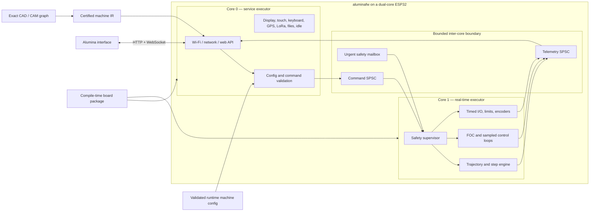
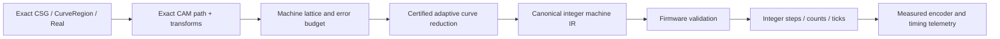

# Target architecture

## System shape



The service core is the only network-facing trust boundary. The real-time core
does not parse HTTP, JSON, YAML, user strings, filesystem data, or graph files.
It receives only already validated, bounded binary frames whose schema version,
configuration digest, sequence, and time range are known.

## Execution domains

### Core 0: service executor

Owns:

- `esp-radio`, Wi-Fi provisioning/AP/STA, `embassy-net`, DHCP/DNS as needed;
- the HTTP/WebSocket server, request parsing, authentication, static web assets,
  API compatibility shims, and command admission;
- configuration parsing, schema validation, persistence, signed OTA staging, and
  file/SD access;
- telemetry encoding, decimation, logging, diagnostics, and time synchronization;
- T-Deck display, touch, keyboard, battery charger, GPS, and LoRa tasks unless a
  particular signal is deliberately assigned to real-time control;
- future non-real-time relay/industrial UI buses and general idle/background
  maintenance; and
- the only general allocator, if an allocator is retained at all.

Does not:

- toggle motion or power-stage outputs directly;
- hold locks needed by the real-time core;
- write flash/NVS or perform OTA while the device is armed; or
- enqueue unbounded work.

### Core 1: real-time executor

Owns:

- the monotonic machine clock and scheduled-event dispatcher;
- safety state, hard limits, emergency stop, enable chains, deadman/watchdogs,
  fault latching, and safe output transitions;
- kinematics execution, lookahead consumption, jerk-limited segment generation,
  step pulse engines, homing, and probing;
- MCPWM/LEDC/RMT/I²S/DMA channels assigned to motion or power control;
- PWM-synchronized ADC/current sampling, FOC transforms and control loops,
  encoders/PCNT/Hall inputs, and servo following-error logic;
- timed ADC/digital/PWM operations deployed from a validated control graph; and
- fixed-rate telemetry sampling into a bounded queue.

Does not:

- allocate after arming;
- read files or network sockets;
- format strings or perform general logging in time-critical paths;
- access PSRAM or flash-resident code/data from an IRAM-safe critical path; or
- wait on a service-core mutex or shared peripheral bus.

### Executor and interrupt construction

Use the ESP Rust runtime’s supported second-core startup and one Embassy executor
per core. There is no task migration or stealing. Async driver construction and
interrupt binding happen on the owning core, because ESP async driver instances
and interrupt handlers are commonly core-affine and not `Send`.

Core 1 may use a high-priority interrupt executor or direct IRAM-safe interrupt
handlers for the innermost pulse/current loops, while retaining Embassy tasks for
slower real-time coordination. “Embassy-based” does not mean every sample is an
ordinary cooperative task: the hardware-timed ISR/DMA layer remains explicit.

### Cross-core messages

Use three independent channels so telemetry pressure cannot delay a stop request:

| Channel | Direction | Semantics |
| --- | --- | --- |
| `CommandQueue<N>` | service to RT | Ordered, bounded, sequence-numbered configuration and scheduled work |
| `UrgentMailbox` | service/safety ISR to RT | Latest-value stop/hold/reset request; never waits behind motion data |
| `TelemetryQueue<N>` | RT to service | Loss-aware snapshots/events; may decimate non-fault samples, never fault edges |

Frames are `repr(C)`-compatible or otherwise have a fixed audited encoding. A
frame carries protocol version, kind, length, sequence, machine clock/deadline,
active configuration digest, payload, and integrity check where appropriate.
Variable-sized jobs live in fixed blocks from statically allocated pools, with
explicit credits and ownership transfer. No frame contains a reference, pointer,
`String`, `Vec`, trait object, or cross-core peripheral handle.

### ESP32 flash/cache constraint

Dual cores do not provide full isolation: flash write/erase operations can
disable caches and block the other CPU. The real-time guarantee therefore also
requires:

- the entire critical call graph in IRAM and constants/state in internal DRAM;
- internal-SRAM DMA buffers and queues, never PSRAM, for the active horizon;
- hardware-timed buffering deep enough to cover measured interrupt latency;
- no flash/NVS/update writes while configured as `Armed`, `Running`, or `Hold`;
- static web assets and code reads admitted during motion only after worst-case
  cache tests on each board/chip; and
- a board-specific deadline and buffer-depth report in release evidence.

### Single-core targets

ESP32-C3/C6 and other single-core variants cannot satisfy the requested physical
core split. The architecture supports metadata for them, but recommends:

- `rt-isolated` production profiles: compile-time reject boards without two
  application cores; and
- optional `cooperative-lab` profiles: one executor with documented reduced
  rates, no simultaneous Wi-Fi and hazardous motion, and a persistent degraded
  capability flag visible in the interface.

The final policy is listed in `OPEN-QUESTIONS.md`.

## Proposed workspace

```text
aluminafw/
├── Cargo.toml                   # virtual workspace, shared lints/dependencies
├── rust-toolchain.toml
├── LICENSES/                    # chosen project license + imported notices
├── THIRD_PARTY.toml             # source URL, revision, license, modifications
├── firmware/
│   ├── Cargo.toml
│   ├── build.rs                 # exactly-one-board checks, metadata/assets
│   └── src/main.rs              # executors and selected board composition root
├── boards/
│   ├── registry.toml
│   ├── mks-tinybee/
│   │   ├── board.toml           # facts/capabilities/aliases/safe states
│   │   └── src/lib.rs           # typed esp-hal resource construction
│   ├── t-deck-pro/
│   └── ...
├── crates/
│   ├── alumina-protocol/        # no_std shared wire types and schema versions
│   ├── alumina-board/           # board capability and allocation contracts
│   ├── alumina-config/          # transactional resource/machine config
│   ├── alumina-runtime/         # core startup, queues, clocks, budgets
│   ├── alumina-safety/          # state machine and safe-output policies
│   ├── alumina-motion/          # kinematics, lookahead, jerk planner
│   ├── alumina-step/            # direct/RMT/I2S pulse backends
│   ├── alumina-foc/             # motor/sensor/driver/current/control layers
│   ├── alumina-control-ir/      # deterministic deployed graph subset
│   ├── alumina-net/             # embassy-net web/API implementation
│   ├── alumina-machine-ir/      # certified integer toolpath format/validator
│   └── alumina-sim/             # host simulation and trace/replay
├── drivers/                     # imported T-Deck and generic async drivers
│   ├── embedded-bus-async/
│   ├── sx126x-async-rs/
│   └── t-deck-pro-*/
├── web-assets/
│   ├── manifest.toml            # expected interface revision and digests
│   └── generated/               # ignored build output
├── schemas/                     # board, config, graph IR, machine IR, API
├── xtask/                       # build/flash/monitor/assets/schema/HIL commands
├── tests/
│   ├── fixtures/
│   ├── property/
│   ├── replay/
│   └── hil/
└── docs/
```

Keep crates narrow enough for host testing. Only `firmware`, board packages, and
hardware backends should depend directly on chip-specific `esp-hal` types.
Protocol, configuration validation, safety transitions, planner math, graph IR,
machine IR, and simulation remain portable `no_std` crates with optional `std`
test features.

## Board and machine model

There are two layers because compile-time chip facts and runtime machine choices
have different failure modes.

### Compile-time board package

A package supplies:

- board ID/revision and ESP chip/target;
- flash, internal RAM, PSRAM, partition, clock, and core capabilities;
- physical GPIO and virtual resource namespaces;
- reserved/strapping/input-only pins and electrical warnings;
- bus wiring, chip selects/addresses, shared-bus relationships, DMA channels, and
  interrupt affinity;
- named devices fitted on the PCB;
- supported timed-output engines and their limits;
- aliases matching silkscreen and common upstream configurations; and
- boot, unconfigured, fault, and watchdog safe states.

The small Rust composition root consumes `esp_hal::Peripherals` exactly once,
constructs owned resources, and returns separate `ServiceResources` and
`RealtimeResources`. Adding a board should not add `cfg` branches throughout
motion, network, or application code.

Build UX:

```text
cargo xtask board list
cargo xtask board check mks-tinybee
cargo xtask build --board mks-tinybee --profile release
cargo xtask flash --board t-deck-pro
cargo xtask capabilities --board mks-tinybee --json
```

`xtask` maps the selected board to the chip target, Cargo features, linker
scripts, partition table, web bundle, and CI/HIL suite. Direct ambiguous builds
fail with a useful error.

### Runtime machine configuration

A configuration maps names such as `axis.x.step`, `spindle.pwm`, `probe`,
`heater.bed`, `serial.modbus`, or `control.loop_1.timer` to resources advertised
by the board. It may select kinematics, limits, scale factors, control policies,
and peripherals, but cannot invent a capability.

Configuration lifecycle:

1. Parse on core 0 with strict size/depth limits.
2. Resolve aliases to stable typed `ResourceId` values.
3. Check electrical mode, timing, frequency, DMA/interrupt, bus-sharing, and
   ownership constraints.
4. Check duplicate claims and combinations forbidden by the board package.
5. Construct an inactive configuration in fixed storage.
6. Send a bounded description to core 1 for independent real-time validation.
7. Commit on both cores using a canonical digest and enter `Configured`.
8. Persist only while safe and idle.

A FluidNC importer may translate compatible YAML into this schema, but the
firmware does not accept arbitrary FluidNC configuration as if it were native.

## Resource abstraction

Avoid a single integer “pin” namespace. Use a stable tagged ID plus a capability
record:

```rust
enum ResourceId {
    Gpio { bank: u8, index: u8 },
    I2sOut { engine: u8, bit: u8 },
    AdcChannel { unit: u8, channel: u8 },
    PwmChannel { engine: PwmEngine, unit: u8, channel: u8 },
    Timer { group: u8, index: u8 },
    RmtChannel(u8),
    PcntUnit(u8),
    I2cBus(u8),
    SpiBus(u8),
    Uart(u8),
    Twai(u8),
    Device(DeviceId),
}
```

The illustrative shape is not a frozen Rust API. The important properties are:
typed namespaces, stable serialization, alias resolution outside real-time code,
and enough metadata to reject impossible operations. A TinyBee alias such as
`IO129` resolves to `I2sOut { engine: 0, bit: 1 }`; it never masquerades as
`Gpio(129)`.

Capability families are staged:

- digital: input, output, open-drain, interrupt, debounce, safety input;
- sampled: ADC, DAC where available, pulse count, encoder, capture/compare;
- timed output: LEDC, MCPWM, RMT, I²S shift stream/static, generic timers;
- buses: I²C, SPI, UART/RS-485, TWAI/CAN, USB, Ethernet, SD/SDMMC;
- radio/network: Wi-Fi, BLE, ESP-NOW, LoRa/GPS devices;
- board devices: displays, touch, keyboards, chargers, expanders, relays; and
- control: stepper axes, servo axes, heaters, spindles, fans, probes, safety.

Supporting “all ESP32 peripherals and protocols” means the schema and UI can
represent these families and new implementations plug into the same lifecycle.
It does not mean every chip peripheral is production-ready in the first release.

## Protocol and web API

### Shared protocol crate

`alumina-protocol` is `no_std`, versioned, and usable by firmware, host simulator,
and interface/WASM. Prefer fixed discriminants, fixed maxima, and an encoding
such as Postcard only after worst-case size and decode-time measurement. Generate
JSON Schema/TypeScript descriptions for discovery/configuration without creating
a second handwritten model.

Every control request carries:

- protocol/schema version;
- board capability digest and active configuration digest;
- client/job/sequence identity;
- desired machine time or deadline where scheduled;
- idempotency/retry semantics; and
- bounded payload length.

### API surface

Proposed routes:

| Route | Purpose |
| --- | --- |
| `GET /api/v1/identity` | board, firmware, boot, security, schema versions |
| `GET /api/v1/capabilities` | resources, devices, limits, clock domains, safety features |
| `GET/PUT /api/v1/config` | inspect or transactionally stage/commit configuration |
| `POST /api/v1/commands` | bounded non-stream control requests |
| `POST /api/v1/jobs` | upload/validate an exact-derived machine-IR job |
| `POST /api/v1/jobs/{id}/{action}` | arm, start, hold, resume, cancel |
| `GET /api/v1/health` | state, faults, queue depths, timing and reset causes |
| `GET /api/v1/time` | device clock and synchronization samples |
| `GET /api/v1/telemetry` | WebSocket upgrade for binary streams/events |
| `POST /api/v1/update` | idle-only signed update staging |
| `/` and immutable assets | compressed Alumina interface bundle |

Compatibility routes from `alumina-firmware` are translated on core 0. Textual
G-code may be offered as an import/compatibility input, but the real-time core
executes only validated machine IR or scheduled resource commands.

## T-Deck integration

The T-Deck Patina application already demonstrates a useful local-actor pattern:
device tasks own async drivers, update a central model, and coalesce expensive
EPD redraws. Retain that pattern on core 0.

- Shared I²C and SPI wrappers remain service-core-local.
- Each device task has a bounded command channel and emits typed events.
- EPD refresh is coalesced and deprioritized behind network admission.
- GPS and LoRa can publish timestamps/telemetry, but do not acquire motion-core
  resources unless a board profile explicitly assigns a real-time function.
- Driver APIs remain usable outside `aluminafw`; application policy belongs in
  adapter tasks, not imported protocol drivers.

## Safety kernel

The safety state machine is small, deterministic, and independently tested.

```text
Boot -> Safe -> Configured -> Armed -> Running
                  ^           |         |
                  |           v         v
                Fault <----- Hold <----+
```

Actual transitions are stricter than this sketch. Key rules:

- Boot configures hazardous pins to board-declared inactive states before normal
  tasks start.
- Configuration cannot arm hardware.
- Arming requires valid configuration, closed safety chain, no latched fault,
  acceptable supply/sensor state, and sufficient real-time buffer budget.
- A hard limit, emergency stop, driver fault, overcurrent, thermal fault,
  following error, clock/buffer fault, or watchdog expiry takes the shortest
  hardware-appropriate path to safe output.
- Hold and emergency stop are distinct: hold uses constrained deceleration when
  safe; emergency stop disables energy according to machine policy.
- Fault reset never happens solely because a browser reconnects or repeats a
  command.
- Web clients receive state transitions but cannot override physical interlocks.

## Advanced stepper motion

The motion stack is layered:

1. Path primitives and kinematics in machine coordinates.
2. Constraint projection from axis velocity, acceleration, jerk, travel, tool,
   and process limits.
3. Forward/reverse lookahead and junction planning.
4. Third-order jerk-limited time law with feed hold/resume and exact end-state
   guarantees.
5. Short execution segments carrying start/end velocity or integer finite
   differences.
6. Per-axis integer step event generation with deterministic rounding/error
   accumulation.
7. Hardware backend: GPIO timer, RMT/DMA, or I²S static/stream.

Synthetos/g2 is a behavioral reference for N-axis jerk-controlled planning,
junction integration, and sub-millisecond linear-velocity segments. Aluminafw
should implement and test the underlying mathematics independently. This avoids
unintentionally importing g2core’s GPLv2/BeRTOS-exception licensing obligations
and lets integer determinism and exact machine-IR requirements shape the design.

The planner reports its bounded compute cost and minimum lookahead horizon. The
executor never plans from network input at the last moment: core 0 admits work
far enough ahead, and core 1 maintains low/high watermark telemetry and performs
a constrained stop before underrun where possible.

## Field-oriented motor control

FOC is a distinct real-time engine, not an alternate mode for a step/direction
socket. A supported profile must declare a PWM-capable inverter/power stage,
rotor feedback, current-sense topology if current control is requested, bus
voltage/temperature sensing, and shutdown path.

Modular layers:

- `MotorModel`: pole pairs, phase resistance/inductance, flux/KV, limits;
- `PowerStage`: 2/3/4/6-PWM mapping, dead time, enable/fault, voltage limits;
- `RotorSensor`: encoder, Hall, magnetic SPI/I²C, analog/PWM, observer;
- `CurrentSense`: inline, low-side, high-side, calibration, sample validity;
- `Modulator`: sine PWM or space-vector PWM;
- `TorqueController`: voltage, estimated current, DC current, dq current;
- `MotionController`: torque, velocity, cascaded or explicitly advanced direct
  position control; and
- `SafetyMonitor`: overcurrent/voltage/temperature/speed/following/sensor faults.

The innermost loop runs from PWM/ADC synchronized timing at a declared frequency.
Velocity, position, trajectory, telemetry, and parameter update rates are
separate clock domains. Parameter changes are range checked on core 0, converted
to a complete fixed-size snapshot, and swapped at a safe real-time boundary.

SimpleFOC is a useful modular and behavioral reference and is MIT-licensed, but
the implementation still needs ESP-specific MCPWM/ADC synchronization, measured
execution budgets, fixed memory, and Alumina’s safety state machine.

## Exact CAD-to-motor boundary

Exactness is preserved by making the lossy boundary explicit and provable, not
by trying to run arbitrary-precision CAD algebra inside a high-rate ISR.



### Exact host side

- CSGRS solids and native Hypermesh/Hypercurve geometry stay exact.
- All work/tool/machine transforms used for CAM are exact `Real` operations.
- A machine profile expresses resolution and calibration as rational values where
  possible, with a separately recorded measurement uncertainty.
- Hypercurve’s finite projection/subdivision is driven by a machine error budget,
  not an arbitrary renderer tolerance.

### Quantization contract

For each job, define:

- coordinate-frame and machine-config digests;
- exact source/CAM digest;
- step/count lattice and timer tick duration;
- maximum spatial, chord, normal, timing, and process error;
- deterministic rounding and residual/error-diffusion rules;
- integer widths and overflow proof/bounds; and
- constraints for velocity, acceleration, jerk, following error, and tool events.

Machine IR is canonical and hashed. V1 should favor a small auditable instruction
set: set state, linearly coordinated integer move, wait/synchronize, sampled
input condition, bounded output action, and job boundary. Native line/arc/Bezier
opcodes are added only when their integer interpolators can carry a verified
error envelope and preserve planner constraints.

The firmware validates structure and machine constraints; it does not trust a
browser-provided “certificate” blindly. The host certificate gives a stronger
geometric guarantee and useful audit trail, while firmware checks everything it
can with bounded integer arithmetic.

## Deployed graphical control

The graph editor has at least three execution domains:

- `HostExact`: CAD/CAM and arbitrary-precision geometry in the browser/desktop;
- `Service`: network, logging, UI devices, files, slow protocols, noncritical
  logic on core 0; and
- `Realtime`: a fixed-memory deterministic subset on core 1.

Every node declares input/output types and units, state size, clock/sample domain,
worst-case execution budget, resource claims, failure behavior, and allowed
deployment domains. Wires are typed synchronous values, bounded streams, or
events with explicit buffering/backpressure semantics. Cross-domain wires compile
to protocol bridges; they are never invisible shared state.

Compilation produces a graph IR plus static schedule/resource report. Core 1
accepts only whitelisted node opcodes with bounded state and preallocated edges.
No arbitrary WASM/native code, recursion, dynamic allocation, or unbounded loops
execute in the real-time graph.

## Security and update model

- Provision unique device identity/credentials; no repository-shared private key.
- Default to same-origin UI/API access and require an authenticated session for
  mutating operations.
- Separate user authorization from the physical `Armed` state.
- Rate-limit and size-limit every parser, upload, and WebSocket stream.
- Use signed firmware and web bundles, anti-rollback policy where required, and
  an A/B or equivalent recoverable update layout.
- Stage and verify updates while safe; commit/flash only while disarmed and idle.
- Store secrets in platform-supported protected storage where threat model and
  hardware permit; never expose them in capability or debug endpoints.
- Generate an SBOM and record firmware, board, interface, schema, and machine
  configuration digests in diagnostics and job records.
