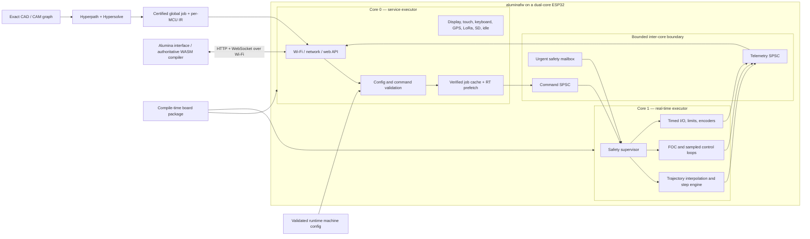
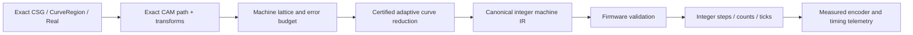

# Target architecture

## System shape



The service core is the only network-facing and persistent-media-facing trust
boundary. The real-time core does not parse HTTP, JSON, YAML, user strings,
storage data, G-code, source geometry, or graph files. It receives only
already validated, bounded binary frames whose exact schema version,
configuration digest, sequence, and time range are known. A schema mismatch is
an update error, not a request to enter a compatibility mode.

The authoritative browser's `ALMEVD03` record is likewise audit material, not a
real-time command format. It commits exact source/metric/approximation identity,
the complete planner policy/certification path, and complete lowering/timer/
executor facts. The browser reconstructs and verifies it before the complete
transaction becomes visible or exportable;
firmware independently admits only the resulting canonical object, manifest,
configuration, and schedule identities. Neither core has a V2 compatibility
parser, and core 1 never receives Hyperreal expression structure.

## Execution domains

### Core 0: service executor

Owns:

- `esp-radio`, Wi-Fi provisioning/AP/STA, `embassy-net`, DHCP/DNS as needed;
- the HTTP/WebSocket server, request parsing, authentication, static web assets,
  Wi-Fi scanning/association, and command admission;
- configuration parsing, schema validation, persistence, signed OTA staging, and
  SD access plus verified job-block prefetch;
- telemetry encoding, decimation, logging, diagnostics, clock-heartbeat capture,
  and UI/device time-model samples;
- T-Deck display, touch, keyboard, battery charger, GPS, and LoRa tasks unless a
  particular signal is deliberately assigned to real-time control;
- future non-real-time relay/industrial UI buses and general idle/background
  maintenance; and
- the only general allocator, if an allocator is retained at all.

Does not:

- toggle motion or power-stage outputs directly;
- hold locks needed by the real-time core;
- write flash/NVS or perform OTA while the device is armed; or
- enqueue unbounded work.

### Core 1: real-time executor

Owns:

- the monotonic machine clock and scheduled-event dispatcher;
- safety state, hard limits, emergency stop, enable chains, deadman/watchdogs,
  fault latching, and safe output transitions;
- certified-schedule consumption, local constraint checks, jerk/finite-difference
  interpolation, step pulse engines, homing, probing, and bounded hold/stop
  fallback;
- MCPWM/LEDC/RMT/I²S/DMA channels assigned to motion or power control;
- PWM-synchronized ADC/current sampling, FOC transforms and control loops,
  encoders/PCNT/Hall inputs, and servo following-error logic;
- timed ADC/digital/PWM operations deployed from a validated control graph; and
- fixed-rate telemetry sampling into a bounded queue.

Does not:

- allocate after arming;
- read files or network sockets;
- format strings or perform general logging in time-critical paths;
- access PSRAM or flash-resident code/data from an IRAM-safe critical path; or
- wait on a service-core mutex or shared peripheral bus.

### Executor and interrupt construction

Use the ESP Rust runtime’s supported second-core startup and one Embassy executor
per core. There is no task migration or stealing. Async driver construction and
interrupt binding happen on the owning core, because ESP async driver instances
and interrupt handlers are commonly core-affine and not `Send`.

Core 1 may use a high-priority interrupt executor or direct IRAM-safe interrupt
handlers for the innermost pulse/current loops, while retaining Embassy tasks for
slower real-time coordination. “Embassy-based” does not mean every sample is an
ordinary cooperative task: the hardware-timed ISR/DMA layer remains explicit.

### Implemented M3 network foundation

The initial adapter initializes the radio and its scheduler-backed allocation on
core 0 before starting core 1. It keeps the Wi-Fi controller, AP device, station
device, `embassy-net` stack, DHCP server, HTTP server, and all socket buffers on
the service side. Firmware reserves a 64 KiB reclaimed-memory heap plus a 36 KiB
ordinary heap for the vendor radio/runtime; the real-time core still performs no
general allocation after arming.

The recovery AP is `192.168.4.1/24`, admits at most four clients, and offers only
`.100` through `.103`. HTTP starts with two handlers, exact route matching,
fixed headers/socket buffers, per-I/O and per-request timeouts, no-store
responses, and a restrictive bootstrap-page CSP. The first linked image exposes
only `/`, `/api/v1/identity`, `/api/v1/health`, and `/api/v1/network` as read-only
bootstrap endpoints. Unknown routes are 404 and mutation methods are 405; there
are no legacy aliases.

This foundation deliberately does not yet claim AP+STA coexistence, scanning,
association, authentication, WebSocket streaming, asset bundles, storage
mutation, or request-rate admission. The controller and station device stay
owned by core 0 for those additions. The selected DHCP adapter may need a
link-layer workaround for clients which clear the DHCP broadcast flag before
they have an IP address, because `embassy-net` cannot necessarily unicast to
their not-yet-learned MAC address; physical-client qualification is mandatory.

The next admission layer keeps authentication policy in portable `alumina-net`
and native service dispatch in portable `alumina-service`. The HTTP task reads at
most 1,148 exact body bytes, verifies a boot-nonce/counter/origin HMAC and
replay/rate policy, then copies one request into a single-slot same-executor
bridge. Browser OPTIONS requests are admitted only for exact API paths, their
proposed GET/POST method and finite Alumina header set are validated, and a
private-network opt-in is echoed only when requested. The response echoes the
one canonical HTTP(S) origin used by the HMAC; wildcard CORS is never emitted.
The sole core-0 service task owns `StorageServiceState`, decodes the frame, and
returns a correlated fixed response. One transaction mutex serializes the
initial mutation surface; transaction IDs prevent a response produced after
HTTP timeout cancellation from satisfying a later request. These same-executor
locks do not mask interrupts on core 1.

`GET /api/v1/storage` returns an authenticated, response-signed JSON status. An
identified but unprovisioned card is `detached`; failed identification is
`faulted`. Status distinguishes physical blocks, selected raw-region blocks,
locator generation/media ID, degraded locator/anchor recovery, and upload versus
provision mutation availability.
`POST /api/v1/control` accepts only a complete native frame and response-signs
the native result. The operation family selects the sole core-0 owner; the route
is not storage-specific. `POST /api/v1/storage` is method-not-allowed, with no
legacy alias. Native admission checks outer/operation lengths, directions,
storage-plan structure, chunk size, and chunk SHA-256. Boot reads the two fixed
hashed provisioning locators at blocks 2046–2047 and mounts only the exact selected raw
region after its media identity and complete committed log replay. Foreign
locator bytes remain detached; damaged recognizable locators fail closed.
`StorageProvision` is the only formatter: its 112-byte canonical request binds
card capacity, expected generation/current ID, exact new interval, fresh ID, and
explicit untrusted-locator recovery intent under SHA-256. The service safety
gate still forbids every format/upload while booting, armed, energized, or
serving real-time work, and no in-RAM success acknowledgement substitutes for
durable storage.

### Cross-core messages

Use independent channels so telemetry or bulk-work pressure cannot delay a stop
request:

| Channel | Direction | Semantics |
| --- | --- | --- |
| `CommandQueue<N>` | service to RT | Ordered, bounded, sequence-numbered configuration and lifecycle control |
| `WorkQueue<N>` | service to RT | Inline-owned canonical 512-byte machine blocks; fixed ring capacity is the producer credit count |
| `UrgentMailbox` | service/safety ISR to RT | Latest-value stop/hold/reset request; never waits behind motion data |
| `TelemetryQueue<N>` | RT to service | Loss-aware snapshots/events; may decimate non-fault samples, never fault edges |

Frames use explicit audited little-endian encoding; Rust `repr(C)` layout is
never treated as wire bytes. A frame carries protocol version, kind, length,
sequence, machine clock/deadline, active configuration digest, payload, and
integrity check where appropriate.
Variable-sized jobs are a nonempty concatenation of canonical 512-byte execution
blocks. The implemented work channel stores those blocks inline in a statically
allocated ring and exposes its free slots as credits. Sending moves a non-`Copy`,
non-`Clone` block into the ring; receiving moves it into core-1-local ownership.
No frame contains a reference, pointer, `String`, `Vec`, trait object, SD address,
or cross-core peripheral handle. The current depth of eight reserves 4,096
payload bytes but is a compile-time foundation, not a qualified time horizon.

Storage chunks and execution blocks are intentionally different boundaries. A
core-0 `PartitionAssembler` accepts arbitrary verified storage slices and emits
at most one complete work block per call. Both cores maintain independent stream
validators over stream/capability/configuration identities, sequence, exact
relative-tick continuity, previous-block digest, per-segment bounds, and cumulative
lattice displacement. A storage-valid but machine-IR-invalid object never gains
a work-queue credit.

Cached blocks use a `StreamTick` newtype, while hardware timestamps use
`DeviceCycle`. The installed commit supplies a future local device epoch and
checked addition maps each relative tick to hardware time. The schedule owner
does not imply that a motor timer executor exists; current target images fault
an otherwise impossible emitted start. The types intentionally
prevent a cached schedule from arming itself or being confused with an absolute
counter sample.

### ESP32 flash/cache constraint

Dual cores do not provide full isolation: flash write/erase operations can
disable caches and block the other CPU. The real-time guarantee therefore also
requires:

- the entire critical call graph in IRAM and constants/state in internal DRAM;
- internal-SRAM DMA buffers and queues, never PSRAM, for the active horizon;
- hardware-timed buffering deep enough to cover measured interrupt latency;
- no flash/NVS/update writes while configured as `Armed`, `Running`, or `Hold`;
- static web assets and code reads admitted during motion only after worst-case
  cache tests on each board/chip; and
- a board-specific deadline and buffer-depth report in release evidence.

### Single-core targets

ESP32-C3/C6 and other single-core variants cannot satisfy the requested physical
core split. They are out of scope: board selection fails before firmware
compilation and no cooperative or degraded motion profile is maintained. Chip
metadata may identify such a target as `unsupported-core-count` so the coverage
ledger explains the rejection.

## Proposed workspace

```text
aluminafw/
├── Cargo.toml                   # virtual workspace, shared lints/dependencies
├── rust-toolchain.toml
├── LICENSE-MIT
├── LICENSE-APACHE
├── LICENSES/                    # imported notices and exceptions
├── THIRD_PARTY.toml             # source URL, revision, license, modifications
├── firmware/
│   ├── Cargo.toml
│   ├── build.rs                 # exactly-one-board checks, metadata/assets
│   └── src/main.rs              # executors and selected board composition root
├── boards/
│   ├── registry.toml
│   ├── mks-tinybee/
│   │   ├── board.toml           # facts/capabilities/aliases/safe states
│   │   └── src/lib.rs           # typed esp-hal resource construction
│   ├── t-deck-pro/
│   ├── mks-esp32-foc-v1/
│   ├── t-lora-pager/            # late metadata/build stub first
│   └── ...
├── crates/
│   ├── alumina-protocol/        # no_std shared wire types and schema versions
│   ├── alumina-board/           # board capability and allocation contracts
│   ├── alumina-capability/      # canonical board bytes, digest, bounded ranges
│   ├── alumina-config/          # transactional resource/machine config
│   ├── alumina-job/             # cached prepare/prefetch/admission lifecycle
│   ├── alumina-service/         # authenticated core-0 native dispatch
│   ├── alumina-runtime/         # core startup, queues, clocks, budgets
│   ├── alumina-clock/           # cycle sampling and scheduled starts
│   ├── alumina-safety/          # state machine and safe-output policies
│   ├── alumina-motion/          # integer schedule checks, RT interpolation/hold
│   ├── alumina-step/            # direct/RMT/I2S pulse backends
│   ├── alumina-foc/             # exact transforms, modulation, dq control/contracts
│   ├── alumina-control-ir/      # deterministic deployed graph subset
│   ├── alumina-net/             # embassy-net web/API implementation
│   ├── alumina-storage/         # immutable SD cache and RT prefetch
│   ├── alumina-sim/             # virtual cache, power loss, service/RT timing
│   ├── alumina-machine-ir/      # certified integer toolpath format/validator
│   └── alumina-sim/             # host simulation and trace/replay
├── drivers/                     # imported T-Deck and generic async drivers
│   ├── embedded-bus-async/
│   ├── sx126x-async-rs/
│   └── t-deck-pro-*/
├── web-assets/
│   ├── manifest.toml            # expected interface revision and digests
│   └── generated/               # ignored build output
├── schemas/                     # board, config, graph IR, machine IR, API
├── board-assets/                # licensed photos, hotspot maps, provenance
├── xtask/                       # build/flash/monitor/assets/schema/HIL commands
├── tests/
│   ├── fixtures/
│   ├── property/
│   ├── replay/
│   └── hil/
└── docs/
```

Keep crates narrow enough for host testing. Only `firmware`, board packages, and
hardware backends should depend directly on chip-specific `esp-hal` types.
Protocol, configuration validation, safety transitions, integer motion
validation/interpolation, graph IR, machine IR, and simulation remain portable
`no_std` crates with optional `std` test features. Exact global path planning
lives with the authoritative interface/CAM library.

## Board and machine model

There are two layers because compile-time chip facts and runtime machine choices
have different failure modes.

### Compile-time board package

A package supplies:

- board ID/revision and ESP chip/target;
- flash, internal RAM, PSRAM, partition, clock, and core capabilities;
- physical GPIO and virtual resource namespaces;
- reserved/strapping/input-only pins and electrical warnings;
- bus wiring, chip selects/addresses, shared-bus relationships, DMA channels, and
  interrupt affinity;
- named devices fitted on the PCB;
- supported timed-output engines and their limits;
- aliases matching silkscreen and common upstream configurations;
- boot, unconfigured, fault, and watchdog safe states;
- licensed annotated board photographs and normalized connector/resource
  hotspot maps; and
- static motor-driver, PWM, ADC/current-sense, storage, and clock capabilities
  needed by the authoritative UI compiler.

The small Rust composition root consumes `esp_hal::Peripherals` exactly once,
constructs owned resources, and returns separate `ServiceResources` and
`RealtimeResources`. Adding a board should not add `cfg` branches throughout
motion, network, or application code.

`alumina-capability` serializes the same package as the canonical allocation-free
`ALMCAP02` document defined in `CAPABILITIES.md`. The SHA-256 excludes only its
own declared field, is compiled into the board package, and is recomputed by
`xtask` and firmware. Public identity advertises digest/length; authenticated
`CapabilitiesGet` reads contiguous bounded ranges through the single native
control route. This document, not `xtask` JSON formatting or Rust memory layout,
is the browser's immutable board authority.

`alumina-config` consumes that exact capability identity and streams canonical
`ALMCFG05` bytes from an inert, content-addressed SD publication. Fixed resource
bindings and reduced exact nominal/uncertainty facts cover stepper, FOC,
process, safety, serial/bus, timer/capture, and general I/O configuration. Core 0
and core 1 hash and run the same semantic validator; only a later durable
activation transaction may publish its digest as active. The normative format
and current closed gate are in `CONFIGURATION.md`.

Build UX:

```text
cargo xtask board list
cargo xtask board check mks-tinybee
cargo xtask build --board mks-tinybee --profile release
cargo xtask build --board mks-tinybee-4mb --profile release
cargo xtask flash --board t-deck-pro
cargo xtask capabilities --board mks-tinybee --json
```

`xtask` maps the selected board to the chip target, Cargo features, linker
scripts, partition table, web bundle, and CI/HIL suite. Direct ambiguous builds
fail with a useful error.

TinyBee's short selector names the 8 MiB primary package. The 4 MiB variant has
an independent board ID, Cargo feature, capacity field, canonical capability
digest, and board-qualified ELF. They deliberately share the physical routing
implementation, but a running image cannot probe flash and exchange one package
for the other. Future partition/web/update layouts must be validated separately
against each exact capacity; a successful 8 MiB build is never fit evidence for
4 MiB.

### Runtime machine configuration

A configuration maps names such as `axis.x.step`, `spindle.pwm`, `probe`,
`heater.bed`, `serial.modbus`, or `control.loop_1.timer` to resources advertised
by the board. It selects kinematics, limits, driver mode, microstepping, motor
and encoder facts, rational scale/calibration, measurement uncertainty,
qualified motion/control limits, process policies, safety chains, and
peripherals, but cannot invent a capability.

Configuration lifecycle:

1. The browser uploads an inert canonical `MachineConfiguration` object.
2. Core 0 streams it with strict fixed bounds, resolves stable typed
   `ResourceId` values, and validates electrical, timing, ownership, duplicate,
   exact-fact, and board-package constraints.
3. Core 0 transfers the exact bytes to core 1, which hashes and runs the same
   semantic validator independently into an inactive candidate.
4. An authenticated commit durably prepares the exact selector while safe and
   idle.
5. Core 1 activates the exact candidate but revokes job authorization and enters
   `Configured`.
6. Core 0 observes that exact state, durably commits the selector, then sends a
   separate exact-identity authorization to core 1.
7. Only then do both job actors receive the active digest. At boot, the same
   object is reopened and both validators rerun before authorization.
8. Status exports exact values, bounded measurements, capability/configuration
   digests, and timing limits needed by the UI to select CAM precision.

FluidNC configuration is research material for board facts, not a supported
runtime format. Alumina uses one native schema and reports unsupported boards or
resources directly.

## Resource abstraction

Avoid a single integer “pin” namespace. Use a stable tagged ID plus a capability
record:

```rust
enum ResourceId {
    Gpio { bank: u8, index: u8 },
    I2sOut { engine: u8, bit: u8 },
    AdcChannel { unit: u8, channel: u8 },
    PwmChannel { engine: PwmEngine, unit: u8, channel: u8 },
    Timer { group: u8, index: u8 },
    RmtChannel(u8),
    PcntUnit(u8),
    I2cBus(u8),
    SpiBus(u8),
    Uart(u8),
    Twai(u8),
    Device(DeviceId),
}
```

The illustrative shape is not a frozen Rust API. The important properties are:
typed namespaces, stable serialization, alias resolution outside real-time code,
and enough metadata to reject impossible operations. A TinyBee alias such as
`IO129` resolves to `I2sOut { engine: 0, bit: 1 }`; it never masquerades as
`Gpio(129)`.

Capability families are staged:

- digital: input, output, open-drain, interrupt, debounce, safety input;
- sampled: ADC, DAC where available, pulse count, encoder, capture/compare;
- timed output: LEDC, MCPWM, RMT, I²S shift stream/static, generic timers;
- buses: I²C, SPI, UART/RS-485, TWAI/CAN, USB, Ethernet, SD/SDMMC;
- radio/network: Wi-Fi, BLE, ESP-NOW, LoRa/GPS devices;
- board devices: displays, touch, keyboards, chargers, expanders, relays; and
- control: stepper axes, servo axes, heaters, spindles, fans, probes, safety.

Supporting “all ESP32 peripherals and protocols” means the schema and UI can
represent these families and new implementations plug into the same lifecycle.
It does not mean every chip peripheral is production-ready in the first release.

## Protocol and web API

### Shared protocol crate

`alumina-protocol` is `no_std`, explicitly versioned, and usable by firmware,
host simulator, and interface/WASM. Firmware and embedded UI ship as one schema
set; differing versions refuse mutation and request a coordinated update. Prefer
fixed discriminants, fixed maxima, and an encoding
such as Postcard only after worst-case size and decode-time measurement. Generate
JSON Schema/TypeScript descriptions for discovery/configuration without creating
a second handwritten model.

Every control request carries:

- protocol/schema version;
- board capability digest and active configuration digest;
- client/job/sequence identity;
- desired machine time or deadline where scheduled;
- idempotency/retry semantics; and
- bounded payload length.

### API surface

Current routes and reserved endpoint roles:

| Route | Purpose |
| --- | --- |
| `GET /api/v1/identity` | board, firmware, boot, security, schema versions |
| `GET/POST /api/v1/network` | scan, inspect, join, leave, or recover AP/STA configuration |
| `POST /api/v1/control` | one authenticated canonical native request across clock, capability, storage, job, configuration, command, and future families |
| `GET /api/v1/storage` | bounded human-readable cache/media status |
| `GET /api/v1/health` | state, faults, queue depths, timing and reset causes |
| `GET /api/v1/telemetry` | WebSocket upgrade for binary streams/events |
| `POST /api/v1/update` | idle-only signed update staging |

Only routes already present in `alumina-net` are accepted today. Capability
ranges use `CapabilitiesGet` through `/api/v1/control`; configuration uses the
same native route rather than creating a parallel REST representation.
Clock samples likewise use the fixed `ClockHeartbeat` native operation rather
than a second REST representation. Telemetry and update endpoints remain
reserved until their bounded wire contracts and admission policies land.
| `/` and immutable assets | compressed Alumina interface bundle |

There are no legacy routes. Textual G-code and source geometry are never accepted
by firmware; UI importers convert supported formats to exact paths before job
compilation. The real-time core executes only locally validated machine IR or
scheduled resource commands.

### SD jobs and multiple MCUs

Core 0 stores content-addressed job chunks and atomically published manifests in
an explicitly provisioned raw SD cache region, then prefetches verified blocks
into fixed internal-SRAM queues. The cache uses alternating hashed anchors and a
hash-chained append log, not filesystem rename semantics. Alternating hashed
locators in fixed blocks 2046–2047 persist the exact region independently of
filesystem metadata; regions begin no earlier than block 2048. Core 1 never
opens storage or trusts media metadata. Writes, compaction, and deletion are
idle-only; reads during a run are bounded and qualified against motion load. A
separate human-readable filesystem partition may be added later, but is not an
executable job authority.

Machine-configuration selection uses the same durability boundary but a
separate prepare/commit/abort state machine. Prepare binds a nonzero operation,
`MachineConfiguration` object digest/length, and exact chunk-manifest digest; it
does not change the replayed active selection. A matching commit changes active
state. Clear uses the same two records and must name the exact active
publication. On boot, an unmatched prepare is inert and is durably aborted
before new configuration work; a committed selection is only a candidate for
reopening and independent validation on both cores. Core-1 activation precedes
selector commit but remains unauthorized for job admission; a separate
post-commit command releases that exact identity. Thus persistence never
bypasses configuration validation or safe-output startup.

The first firmware job slice now gives the service task sole ownership of a
bounded `ServicePrefetch` actor and the real-time task sole ownership of an
independent `RealtimeJob` actor. An authenticated `JobPrepare` descriptor binds
one exact publication, stream, capability/configuration identities, axis width,
block count, and machine limits. Core 0 reads at most one verified storage chunk
per executor pass and stops on ring backpressure. Core 1 revalidates and retains
at most the first block. The portable motion composition preflights every
segment, retains that unique block token throughout exact execution, and returns
it to the job actor for acknowledgement only after terminal tick and cumulative
lattice position independently agree. Core 1 now installs that executor from the
independently active configuration, binds the descriptor's exact absolute
machine-lattice origin and scheduled epoch, and advances only after the selected
target confirms each complete-image commit. Boot-bound prepare plus
participant-bound install/confirm/abort and qualified interlock/arm/start gates
are implemented. TinyBee's blocking bootstrap writer remains deliberately
unqualified, T-Deck Pro exposes no motion backend, and constrained hold/resume
and hardware-timed serializer qualification remain later gates.
Cancellation clears core-0 partial state, invalidates the core-1 ownership
token, and drains queued work. Core-0 local job ownership vetoes storage
mutation immediately, without waiting for periodic safety telemetry.

The shared job crate now also owns canonical global manifest schema V1. Its
fixed header and sorted fixed participant records bind the authoritative
source/compiler/policy/machine/coordinate/safety identities to every local
partition, resource/error/safety envelope, timer span, and terminal lattice
state. Allocation-free decode recomputes the participant-set digest and proves
each local rational duration equals the exact global duration. The complete
manifest content digest and participant-set digest feed the existing schedule
commit fields directly; firmware and interface therefore do not need parallel
manifest models.

Both first board packages now carry verified nonzero canonical capability
digests. Firmware routes authenticated configuration validation/commit/rollback,
replays the durable selector at boot, independently revalidates on both cores,
and hands a digest to job actors only after post-commit authorization. Both
packages remain non-armable pending HIL, so the target endpoint still rejects
`JobPrepare` as `Unsupported`. Capability and configuration publication are not
authorization to run, preserving an inspectable integration path without
creating an accidental executable path.

For a distributed job, the UI maintains one measured affine mapping from its
monotonic clock to each MCU's unwrapped cycle counter. Every MCU must cache and
validate its own partition. Exact causal clock intervals map one future UI epoch
to each local counter. Commit installs but cannot start; a separate confirmation
is accepted only after all install acknowledgements and before an earlier
deadline, leaving a later abort guard for reconciliation. At that guard, core 1
irrevocably primes a continuous board-qualified output horizon and must report
`Primed` before start. The hardware timeline releases at the exact MCU epoch;
the schedule's later `Start` action only reconciles software and safety state.
This is deterministic within a certified uncertainty, not an atomic Wi-Fi
transaction. Details and failure semantics are normative in
`DISTRIBUTED-JOBS.md`.

## T-Deck integration

The T-Deck Patina application already demonstrates a useful local-actor pattern:
device tasks own async drivers, update a central model, and coalesce expensive
EPD redraws. Retain that pattern on core 0.

- Shared I²C and SPI wrappers remain service-core-local.
- Each device task has a bounded command channel and emits typed events.
- EPD refresh is coalesced and deprioritized behind network admission.
- GPS and LoRa can publish timestamps/telemetry, but do not acquire motion-core
  resources unless a board profile explicitly assigns a real-time function.
- Driver APIs remain usable outside `aluminafw`; application policy belongs in
  adapter tasks, not imported protocol drivers.

## Safety kernel

The safety state machine is small, deterministic, and independently tested.

```text
Boot -> Safe -> Configured -> Armed -> Running
                  ^           |         |
                  |           v         v
                Fault <----- Hold <----+
```

Actual transitions are stricter than this sketch. Key rules:

- Boot configures hazardous pins to board-declared inactive states before normal
  tasks start.
- Configuration cannot arm hardware.
- Arming requires valid configuration, closed safety chain, no latched fault,
  acceptable supply/sensor state, and sufficient real-time buffer budget.
- A hard limit, emergency stop, driver fault, overcurrent, thermal fault,
  following error, clock/buffer fault, or watchdog expiry takes the shortest
  hardware-appropriate path to safe output.
- Hold and emergency stop are distinct: hold uses constrained deceleration when
  safe; emergency stop disables energy according to machine policy.
- Fault reset never happens solely because a browser reconnects or repeats a
  command.
- Web clients receive state transitions but cannot override physical interlocks.

The portable `SafetyInputMonitor` consumes the exact core-1 configuration
profile rather than numeric pin aliases. It retains at most 32 stable slots for
GPIO or board-local safety inputs, applies configured polarity and separate
assert/release debounce intervals in the local `DeviceCycle` domain, rejects
nonmonotonic samples, and marks an input stale on the first cycle beyond its
finite sample-gap promise. A late sample is rejected and cannot retroactively
heal the missing interval. Arming requires every configured safety input to be
known and fresh and every arm-required input inactive. The conservative default
makes every fault-class role arm-required; only a probe may remain active until
an operation-specific homing/probing policy is qualified. Typed transitions
keep E-stop, interlock, limit, driver fault, and probe semantics distinct; the
first-release mapping faults on the first four classes and requests a hold for a
probe.

The target composition now realizes that profile as a fixed ESP GPIO bank on
core 1. TinyBee admits GPIO 33, 32, and 22 with optional on-chip pull-up/down and
GPIO35 in floating mode only; T-Deck Pro intentionally exposes no machine
safety-input route. Activation validates the complete route/pull/cadence set
before applying any configuration-specific bias. One nominal 1 ms pass samples
every stable slot at the same `DeviceCycle`; late passes retain the portable
watchdog's no-healing rule. Stable masks and the next watchdog deadline travel
in the canonical 72-byte safety snapshot and are independently checked on core
0. A fault synchronously reapplies the board-safe transaction, invalidates the
admitted block and schedule, then latches the first fault reason. Until a
constrained-deceleration backend is qualified, Hold deliberately degrades to a
safe Stop. Once faulted, core 1 preserves the terminal input observation without
retriggering a non-healing sample-gap fault on every pass. Poll latency, contact
conditioning, ESP pull behavior, simultaneous edge latency, and the safe-image
rewrite still require physical HIL.

## Advanced stepper motion

The motion stack is layered:

1. Browser/WASM exact path primitives, machine kinematics, and process facts.
2. Browser/WASM axis constraint projection, forward/reverse lookahead, junction
   limits, and third-order jerk-limited time law.
3. Certified quantization into short canonical integer/fixed-point execution
   segments with exact end-state and error evidence.
4. Core-0 schema/hash/config validation, SD cache, and bounded prefetch.
5. Independent core-1 local rate/range/continuity validation and schedule
   consumption.
6. Core-1 integer finite-difference interpolation, per-axis step events, and
   bounded local hold/stop fallback for asynchronous safety events.
7. Hardware backend: GPIO timer, RMT/DMA, or I²S static/stream.

Layer 2 now has an exact acceleration-reachability core: Hyperpath combines
caller/global/tangent/retained-radius node ceilings, propagates squared-speed
limits forward and backward over exact retained lengths, and independently
replays every selected node and span through Hypersolve. Alumina currently
supplies zero entry/exit and geometric-radius ceilings. Hyperpath additionally
partitions structurally positive nodes into stop-separated components and
lowers each component by exact uniform halving until every touching span owns a
separately constructed and generically replayed two-phase monotonic transition.
Alumina grants a positive internal ceiling only to lossless exact source-line
pairs with an independently classified G1 join. Zero/zero spans retain the
four-phase rest-to-rest branch; curvature-bearing joins, true corners,
reversals, and approximated cubic chords remain stops.

For affine spans, Hyperpath now projects exact nonnegative `|dq_i/ds|` rows
against velocity, acceleration, and jerk limits for any dense axis count. It
selects each exact route-wide scalar minimum and independently replays every
span/axis inequality and bottleneck through Hypersolve. The current Cartesian
browser compiler derives unit-direction rows for an all-line route. A route
containing a curve retains conservative direction-independent limits and no
affine report. Curvature-aware projection, nonlinear kinematics, retained blend
geometry, vector-jerk-aware limits, general and time-optimal profiles,
mixed-clock/common-event-grid retiming, and hold/resume replanning remain open.

Layer 3 now ceilings each exact ideal interval to the configured output quantum
after applying one exact rational factor. A caller-bounded binary search
rebuilds and completely replays candidates through the layer-5 production
validator, selects the smallest admitted factor, and proves the immediate
predecessor still fails for duration pressure. The continuous electrical-limit
fixture selects exactly `4158/4096`; no arbitrary float margin enters the path.

For a same-grid multi-MCU job, the browser now runs that construction across
the complete participant set before immutable cache publication. V1 requires
equal exact ideal cumulative event times, timer frequency, and output quantum.
Every factor candidate replays every participant through the unchanged
production validator; the smallest jointly accepted factor and complete
immediate-predecessor outcome vector are retained. A participant may accept the
predecessor while another supplies the rejecting bottleneck.

Selected ticks and step deltas are replayed against each retained exact point
carrier before local block construction. Independently replayed partitions are
then committed by `ALMSYN01`/`ALMSRT01`, and the evidence digest supplies the
global manifest synchronization and per-participant timing/error identities.
These are browser audit formats only. Core 1 still accepts only fixed machine
IR and never parses Hyperreal, planner, or shared-evidence transcripts.
The reproducible checkpoint is recorded in
[`evidence/M10-SHARED-MCU-TIMER-RETIMING.md`](evidence/M10-SHARED-MCU-TIMER-RETIMING.md).

The portable `alumina-motion` executor now implements the first step-only part
of layers 5–7 without owning hardware. It validates a dense stepper profile
derived from the exact active configuration, rejects overflow/rate/pulse/
direction/enable timing violations before installing a segment, and emits
allocation-free logical transactions at exact `DeviceCycle` deadlines. Each
backend declares a nonzero integer output quantum `q`; the epoch and segment
boundaries must lie on that lattice. For `steps = n`, a duration of `d/q`
output quanta, and zero-based event `k`, the rising-edge quantum is the nearest
integer to `(2k + 1)(d/q)/(2n)`. Therefore every accepted edge remains within
`q/2` device cycles of the unquantized centered edge, every physical edge is
representable by the backend, and the final step count/lattice position remains
exact. The report carries this bound in half-device-cycle units without a
floating-point conversion.

`CachedStepperExecutor` closes the ownership gap between the independently
validated job actor and that event engine. Before accepting a block it advances
a private logical snapshot analytically through every segment, proving timing,
ordering, counter, and final-position constraints in work bounded by segment
count times axis count rather than requested step count. The live executor is
unchanged on rejection. Once accepted, the unique `AdmittedBlock` remains with
the event engine until the final segment completion matches the block's
independent progress certificate. Faulted work cannot be acknowledged and is
released only after the immediate safe logical transaction has been issued;
physical application remains a separate backend fact.

The parallel direct path is now implemented without weakening that ownership
model. `JobDescriptor` V3 binds one execution kind and a nonzero per-record
update bound only for direct streams; both core-0 prefetch and core-1 admission
select the matching validator, and a kind substitution faults before progress
is admitted. `FiniteDifferenceStepperExecutor` consumes each declared Q31.32
update at its exact output-grid deadline, even when no integer boundary is
crossed. It emits the same logical direction, enable, step-rise, step-fall, and
terminal-disable transactions as the coordinated executor. Sparse admission
retains direction/enable state and prior rise/fall history across records and
blocks, while exact crossing searches keep validation independent of dense job
duration. `CachedFiniteDifferenceExecutor` privately fast-forwards the entire
candidate block, then retains its unique token through every live recurrence
update and terminal numerical comparison. The executor, rather than the block,
owns a scheduled pulse fall, so a valid pulse may cross a contiguous record or
cached-block boundary without inserting a false dwell. Block release still
requires agreement on terminal tick, integer position, and the separately
retained Q31.32 state. Normal job finish remains illegal until every pending
fall has been emitted and the configured enable-hold interval has elapsed.

`alumina-sim::motion` now replays immutable `ALMBLK02` direct partitions through
real `RealtimeJob` admission and this dense cached executor. It counts empty and
edge-producing updates separately, acknowledges each token in order, drains a
terminal cross-block pulse, and compares both terminal lattices. This is
portable numerical/output-state evidence. The direct event stream is not yet composed into TinyBee's qualified
PCM/DMA owner, no target timing/WCET claim is made, and every board remains
non-armable for this path.

A separate complete-image mapper binds those logical transactions to configured
I²S bit resources, respects active-high/active-low enable or disable semantics,
and preserves every unrelated shifted output. It accepts only a fully defined
safe image and rejects duplicate routes, an active safe-state step, an enabled
safe-state driver, out-of-width/conflicting events, and impossible step-level
history without mutating the retained image. This is not yet an ESP32 I²S DMA
backend or a hardware qualification: TinyBee remains non-armable until serializer
word/WS phase, timing, safe-image, and load behavior are measured on the board.

The target composition adds an explicit two-phase boundary around that mapper.
At most one generated complete image can be pending, and a boot-local token plus
the scheduled cycle must match the target's post-write upper-bound observation.
Wrong-token, early, or over-bound commits latch execution; a block cannot return
to its job actor until every image is physically acknowledged. Normal terminal
disable passes through the same boundary after the exact enable-hold deadline.
An asynchronous stop first reapplies the board-safe physical transaction, then
invalidates pending logical tokens and outstanding work. TinyBee currently uses
the static bootstrap shift writer solely as a compile/HIL staging path with a
zero qualification claim, so it cannot satisfy arm authority.

`ScheduledShiftedStepper` is the portable successor for a continuously timed
backend. It has a fixed allocation-free ring and treats generation, acceptance
into the sole immutable hardware timeline, and physical latch observation as
three different ordered states. A full ring stops planning without discarding
the next event; a staging mismatch, reordered token, early latch, or late latch
is terminal. Logical block completion records an exact generated-update prefix
and terminal cycle. A fixed two-block window may admit and plan the successor
while the prior token remains retained; the prior block returns as soon as its
own prefix is physically committed and its terminal cycle observed, even when
later images remain queued. Admission and completion barriers are strict FIFO,
and an invalid successor invalidates the complete window. Terminal driver
disable is scheduled and physically acknowledged through the same ring. It is
inserted while the final block remains owned, before physical draining could
consume the hardware lead needed by a circular target. If the earliest legal
disable would coincide with the prior complete image, it moves to the next exact
output-grid boundary; two different images never claim one physical latch.

The next serializer layer is now explicit and portable. `PcmShortMonoFrame`
encodes one full, already composed image into a 32-bit mono sample repeated in
both fixed slots; the final chain-width suffix before each rising frame-sync
edge is therefore complete in the modeled wire order. `PcmShortFrameGrid`
accepts only an integer relationship between the device counter and frame rate,
and every scheduled image must be aligned to a future latch boundary with one
whole transmit-frame lead. `PcmShortTimeline` expands sparse future image
updates into a continuous dense stream, repeating the prior complete image in
every unchanged frame. It never rounds a cycle, emits a partial image, or plans
an update after its transmit frame has passed.

`PcmShortDmaHorizon` adds portable circular-ring ownership without pretending to
be a peripheral driver. Construction records an externally safe-prefilled ring.
The target reports exact whole-frame slots released by DMA; the owner previews
one dense frame, the target pushes exactly that frame, and only an explicit
acceptance advances the sealed hardware horizon. An unexpected availability
shrink, frame mismatch/order error, missed update, underrun, or external fault
latches the owner and invalidates every retained tag. Descriptor release grants
refill authority only. A separate monotonic observation of qualified physical
latch boundaries is required before a materialized tag can become a motion
commit.

`alumina-sim` independently shifts all 64 modeled serial bits and reconstructs
the image observed at the following latch. Wrong frame index/timing/contract,
wire-versus-metadata disagreement, and a missing frame at its boundary latch a
fault without inventing further motion. This proves the software frame and
pipeline contract only. It does not prove DMA memory order, FIFO phase, the
original ESP32 startup clocks, GPIO-matrix handoff, descriptor completion versus
physical WS observation, underrun behavior, or a safe stop. Those facts keep the
target backend and arm gate closed until logic-analyzer HIL.

The host integration now joins these two portable layers end to end. A 1 MHz
execution domain and 250 kHz modeled frame grid create a four-cycle output
quantum; exact motion images are accepted one frame early, reconstructed from
the serial wire at their latch boundaries, and only then committed to the
motion owner. The simulator proves that draining the last image at cycle 136
does not release a block whose output-free terminal boundary is cycle 140, and
that the enable-hold-aligned disable at cycle 144 remains separately pending.
Those rates are fixtures, not TinyBee configuration or physical evidence.

A second host integration starts with a four-frame safe ring, models one
descriptor becoming CPU-owned for each transmitted frame, refills each released
slot from `PcmShortDmaHorizon`, and reconstructs the independent 64-bit wire.
The final disable is already in the sparse plan before the block token can
return and becomes visible before the job actor acknowledges completion. A
two-block variant validates both blocks before start, plans the successor while
the predecessor is retained, emits one uninterrupted dense frame sequence, and
returns each block at its independent commit-count barrier. This proves bounded
cross-block circular ownership and ordering in software; it does not equate a
DMA descriptor EOF with WS or qualify an ESP32 interrupt.

The first target-facing fixture is a separate TinyBee safe-image-only binary,
not a feature path through production firmware. It establishes the static safe
transaction first, never initializes Wi-Fi/storage/motion/the second core,
brackets the I²S start call in the local cycle domain, refills 50,000 exact safe
frames through the portable owner, explicitly stops the transfer, rewrites two
safe samples, and parks. Its `xtask` command is build-only. Because the unknown
first-frame phase is the subject of the capture, disconnected loads and manual
waveform review remain mandatory; a successful software report cannot promote
the board.

Synthetos/g2 is a behavioral reference for N-axis jerk-controlled planning,
junction integration, and sub-millisecond linear-velocity segments. The
interface compiler and firmware executor implement their respective underlying
mathematics independently, with shared clean-room requirements and separately
structured reference tests. This avoids importing g2core’s GPLv2/BeRTOS-exception
implementation and lets Hyper exactness, integer determinism, and local safety
shape the design.

The UI compiler reports precision/refinement cost and the required execution
horizon. The executor never plans from network input at the last moment: core 0
admits cached work far enough ahead, and core 1 maintains low/high watermark
telemetry and performs a constrained stop before underrun where possible.

## Field-oriented motor control

FOC is a distinct real-time engine, not an alternate mode for a step/direction
socket. A supported profile must declare a PWM-capable inverter/power stage,
rotor feedback, current-sense topology if current control is requested, bus
voltage/temperature sensing, and shutdown path.

Modular layers:

- `MotorModel`: pole pairs, phase resistance/inductance, flux/KV, limits;
- `PowerStage`: 2/3/4/6-PWM mapping, dead time, enable/fault, voltage limits;
- `RotorSensor`: encoder, Hall, magnetic SPI/I²C, analog/PWM, observer;
- `CurrentSense`: inline, low-side, high-side, calibration, sample validity;
- `Modulator`: sine PWM or space-vector PWM;
- `TorqueController`: voltage, estimated current, DC current, dq current;
- `MotionController`: torque, velocity, cascaded or explicitly advanced direct
  position control; and
- `SafetyMonitor`: overcurrent/voltage/temperature/speed/following/sensor faults.

The innermost loop runs from PWM/ADC synchronized timing at a declared frequency.
Velocity, position, trajectory, telemetry, and parameter update rates are
separate clock domains. Parameter changes are range checked on core 0, converted
to a complete fixed-size snapshot, and swapped at a safe real-time boundary.

SimpleFOC is a useful modular and behavioral reference, but Alumina uses a
clean-room implementation driven by published control mathematics, device
datasheets, independently written behavioral tests, ESP-specific MCPWM/ADC
synchronization, measured execution budgets, fixed memory, and Alumina’s safety
state machine.

The first power profile is MKS ESP32 FOC V1.0, not TinyBee. Its V1.0 schematic
establishes dual 3-PWM stages on GPIOs `32/33/25` and `26/27/14`, AS5600 buses
on SDA/SCL `19/18` and `23/5`, encoder auxiliary/index inputs `15` and `13`, and
inline current inputs `39/36` and `35/34`. The current inputs are ADC1 pins on
classic ESP32, avoiding its ADC2/Wi-Fi conflict. The same schematic marks
GPIO22 and GPIO12 unconnected: no independent inverter enable is established,
and no such resource may be invented from example code. It also establishes no
fitted mutable cache medium. Polarity, analog gain, sample topology, ratings,
dead time, reset behavior, and physical shutdown remain unqualified until
measurement. Each phase signal drives a paired EG2133 active-high HIN and
active-low LIN-bar input. Its primary truth table says a driven low selects the
low side and a driven high selects the high side; the internal HIN pull-down and
LIN-bar pull-up make high impedance the only documented both-off candidate.

The compile-only target consequently owns MCPWM0/1, ADC1, both encoder buses,
and all six phase pins exclusively on core 1, makes phase and digital encoder
pins no-pull inputs before the first await, retains the four hardware-input-only
current GPIO singletons, and exposes no FOC commit path.
MCPWM and ADC tokens are sealed in closed type states with no extractor and no
`PowerStage`/`CurrentSense` implementation. GPIO2 is tied into the USB
auto-programming/strap circuit and remains service-owned. Core 0 owns Wi-Fi and
reports an unavailable cache transport. Configuration V5 retains the explicit
qualified shutdown, rotor, controller, current-map, and PWM/ADC timing records
and adds canonical ADC-frontend and PWM-hardware selections. The MKS topology
selects phase high impedance, but its `Described` stage cannot validate that
contract until physical evidence
promotes the immutable board package to `Qualified`. A fake enable binding,
implicit GPIO alias, or configuration-side qualification claim is prohibited.

Portable rotor angle is a wrapping `u32` binary turn, so pole-pair reduction,
quadrants, and wrap remain exact. `alumina-foc` reduces to `[-pi/4, pi/4]`,
evaluates independently certified outward Q2.30 sine/cosine bounds, and admits
the result only under explicit component-width and squared-norm ULP limits.
Absolute-count calibration separately retains direction, count modulus,
reference/electrical offset, pole pairs, reduced rational count error, binary
alignment error, and the configuration digest. A rotor sample carries the full
phase-error arc and must replay to the same canonical rotation.

`alumina-as5600` now provides the preceding read-only transport boundary. It
owns one async seven-bit I²C transport, decodes the exact 12-bit RAW ANGLE count,
preserves documented and reserved STATUS bits separately, and can bracket a raw
count with before/after field-status reads without claiming simultaneity. It
exposes no sensor configuration or OTP/burn operation. On MKS, safe boot leaves
both mode-selectable connectors dormant with every line an input. A separate
synchronous type-state transition can select two independent 400 kHz AS5600
buses; it sends no I²C transaction. That transition and all read methods are
compiled but deliberately unscheduled pending stored connector-mode selection
and HIL. Converting a count into a `RotorSample` remains the digest-bound
`RotorCalibration` responsibility; sensor timing, alignment, and error bounds
remain unqualified.

The portable current boundary is similarly evidence-bearing rather than a raw
`u16` shortcut. Each channel snapshot declares an inclusive interior ADC code
window, strictly bracketed selected-zero code, polarity, outward Q2.30
normalized-current-per-count interval, additive error, and maximum result
width. Conversion evaluates `(raw - zero) * gain_interval` exactly in a widened
integer domain and then widens by the additive bound. That bound must include at
least half of the upper gain, so ADC quantization cannot disappear. Validation
checks both channel endpoints and all four two-shunt endpoint pairs against the
configured current and interval-width limits.

A PWM/ADC synchronization snapshot lives entirely in the boot-local device
cycle domain. Each current observation retains the configuration digest, duty
commit token, PWM period sequence/start, acquisition start, both sample-and-hold
cycles, conversion completion, and the nearest switching edges surrounding the
aperture. Validation binds the exact integer PWM period to the FOC snapshot and
checks trigger jitter, acquisition span, interchannel skew, conversion latency,
period containment, and edge guards. The measured pair is widened by a declared
current-slew bound before the third phase is reconstructed; loss of interval
correlation is retained as an explicit zero-sequence bound for Clarke
transformation. A validated wrapper avoids rechecking the immutable calibration
on every real-time observation, while `CurrentSample::validate_for` replays the
raw codes and timing stamp before controller use.

An isolated timing stamp cannot prove that its duty token corresponds to the
physical compare image, that its edge cycles are truthful, or that period
sequences are continuous. Those are obligations of the future sole-owner
MCPWM/ADC backend, integer compare-image audit, stream state machine, and HIL.
The MKS target can now consume ADC1 and its four fixed input pins into a
software-started diagnostic owner with explicit approximate attenuation and a
strict two-channel sequence. Its timestamps are conversion-completion
observations, not sample apertures; it has no digest or PWM token and cannot
implement `CurrentSense`.

The portable PWM boundary uses a center-aligned up/down counter contract. The
device-cycle rate must equal PWM rate times the device-cycle period, while the
post-prescaler counter clock must equal PWM rate times twice the integer timer
peak. For each phase, midpoint selection with ties-to-even chooses one compare;
the outward Q2.30 enclosure of that exact rational and the ceiling distance to
both original interval endpoints remain attached. Minimum compare distance from
both rails prevents a mathematically valid interval from silently producing an
inadmissible high or low pulse. Counter-tick edges are `compare` and
`2 * peak - compare`; converting either into `DeviceCycle` remains a later
explicit clock-domain operation.

Complete images retain digest, token, schedule, original duties, all selected
compares, and their error/edge facts. The portable latch owner replays the image,
accepts at most one future boundary on its exact period grid, and requires every
timer zero to be observed once in sequence. MKS can separately consume each raw
MCPWM token into a closed HAL owner: timer 0 is configured in up/down mode, then
immediately stopped and reset to zero because the HAL exposes no
configure-while-stopped call. No operator is attached to any pin and the owner
exposes no controller, timer, compare write, or `PowerStage` implementation.

`ALMCFG05` joins these portable contracts at the only executable boundary. One
FOC axis must bind all three phase outputs, the exact two ADC channels named by
its phase-pair selector, an encoder endpoint, and a qualified power-stage
shutdown topology. Fixed records retain loop rates and dividers, both PI loops,
absolute-count rotor calibration and ULP policy, both current maps, both
programmed ADC attenuations, the complete PWM/ADC timing envelope, and the exact
MCPWM source/counter clocks, timer peak, minimum pulse, compare-error policy,
and raw prescalers. Reduced scalar authorities must exactly equal
the duplicated integer pole-pair, encoder-modulus, carrier, control-rate, and
dead-time facts. Only after independent full-stream SHA-256 validation can the
private real-time configuration container inject that digest and revalidate a
`FocParameterSnapshot`, `RotorCalibration`, proof-wrapped
`TwoShuntCurrentCalibration`, and `PwmCompareContract`. MKS target lowering also
checks the compiled capability digest, fixed stage/phase/ADC topology, AB pair,
and 12-bit ADC range before it can construct the otherwise-private stopped
MCPWM selection. This is lowering, not peripheral activation: the MKS stage
remains non-armable, and no operator is attached to a phase pin.

## Exact CAD-to-motor boundary

Exactness is preserved by making the lossy boundary explicit and provable, not
by trying to run arbitrary-precision CAD algebra inside a high-rate ISR.



### Exact host side

- CSGRS solids and native Hypermesh/Hypercurve geometry stay exact.
- All work/tool/machine transforms used for CAM are exact `Real` operations.
- Hyperpath owns exact toolpath elements, retained provenance, path length/feed
  reports, affine dense-axis constraint projection, junction lookahead, and
  jerk-ramp scheduling where available.
- Hypersolve proposes and certifies constraint solutions; approximate candidates
  never bypass exact residual or interval-certified replay.
- A machine profile expresses resolution and calibration as rational values where
  possible, with a separately recorded measurement uncertainty.
- Hypercurve’s finite projection/subdivision is driven by a machine error budget,
  not an arbitrary renderer tolerance.

### Quantization contract

For each job, define:

- coordinate-frame and machine-config digests;
- exact source/CAM digest;
- step/count lattice and timer tick duration;
- maximum spatial, chord, normal, timing, and process error;
- deterministic rounding and residual/error-diffusion rules;
- integer widths and overflow proof/bounds; and
- constraints for velocity, acceleration, jerk, following error, and tool events.

The coordinated stepper lowering ceilings each retained exact ideal interval to
the configured output quantum after applying one exact rational factor. A
bounded binary search admits only firmware-classified duration pressure and
selects the smallest factor whose complete canonical stream passes production
preflight; the immediate predecessor must retain a timing failure. Intentional
dilation is reported separately from the strictly sub-quantum grid padding and
spatial error budget. The same-grid multi-MCU compiler now selects that factor
jointly across every participant and records the complete predecessor outcome
vector. Mixed clocks remain an explicit-event-grid contract rather than a
tolerance shortcut.

Machine-block schema V2 is canonical and hashed. Kind `1` retains coordinated
integer displacement records. Kind `2` adds direct third-order Newton forward
differences in a common signed Q31.32 step lattice: `p0`, `d1`, `d2`, and `d3`
per axis plus one exact update period/count. Nearest-integer ties-to-even is the
sole step projection. Firmware independently proves checked closed-form state,
exact Q31.32 continuity, monotonic direction within a record, bounded rounded
displacement, and a strict first-difference ceiling before any dense recurrence
is installed. Native line/arc/Bezier opcodes remain excluded unless an integer
interpolator can carry a verified error envelope and preserve planner
constraints. A global job is partitioned into one local stream per MCU.

The firmware validates structure and machine constraints; it does not trust a
browser-provided “certificate” blindly. The host certificate gives a stronger
geometric guarantee and useful audit trail, while firmware checks everything it
can with bounded integer arithmetic.

## Deployed graphical control

The graph editor has at least three execution domains:

- `HostExact`: authoritative CAD/CAM and arbitrary-precision geometry in
  browser/WASM;
- `Service`: network, logging, UI devices, files, slow protocols, noncritical
  logic on core 0; and
- `Realtime`: a fixed-memory deterministic subset on core 1.

Every node declares input/output types and units, state size, clock/sample domain,
worst-case execution budget, resource claims, failure behavior, and allowed
deployment domains. Wires are typed synchronous values, bounded streams, or
events with explicit buffering/backpressure semantics. Cross-domain wires compile
to protocol bridges; they are never invisible shared state.

Compilation produces a graph IR plus static schedule/resource report. Core 1
accepts only whitelisted node opcodes with bounded state and preallocated edges.
No arbitrary WASM/native code, recursion, dynamic allocation, or unbounded loops
execute in the real-time graph.

The current portable boundary is the fixed 4 KiB `ALGRIR02` package documented in
[`GRAPH-IR.md`](GRAPH-IR.md). Its allocation-free decoder admits only a
Service Boolean Stream constant, a Realtime latest-at-or-before Boolean
transition, a Realtime sink, and a Realtime stable Boolean safety-input read,
with fault-on-full realtime queues, one-way Service-to-Realtime bridges,
contiguous arenas, and one integer device-cycle schedule per active domain. A
separate browser compiler registry now binds the complete audited semantic and
fixed implementation identities, derives exact arenas and opcode/resource
palettes from the authenticated target capability document, proves one target,
schedule, WCET reserve, and fixed arena policy, and emits bytes replayed by that
decoder. A portable runtime now admits the requested package and exact
device/capability/configuration/implementation identities into const-generic
state and queue arrays, independently checks each opcode and resource tuple
against the image's static board palette, primes Service tick zero, uniquely
splits core-local owners, and executes the four fixed opcodes with a bounded
critical-section bridge and first-cause fault latch.

The package lifecycle is now composed into the actual split-core firmware. The
browser publishes the 4 KiB package as an immutable typed SD object and drives
authenticated install/status/activate requests. Core 0 independently reads and
admits all bytes before sending bounded Begin/Data/Finish commands; core 1
independently rehashes and admits a separate staging image, then selection and
service agreement gate visibility of a distinct active image. Combined
telemetry reports both actors, and active/in-flight graph state excludes
configuration and job mutation. Permanent core-local actors construct, prime,
split, and schedule the fixed runtime from authenticated future epochs. Graph
selection uses a two-phase raw-media journal: prepare precedes core-1 selection,
commit precedes authorization, and boot repeats byte-for-byte admission only
after the committed configuration is authorized. TinyBee's first resource
opcode can read only known, fresh, debounced semantics for the four configured
safety inputs; unavailable state faults rather than becoming clear. T-Deck Pro
and MKS ESP32 FOC expose no graph-addressable physical resource yet. There is
still no graph output opcode, measured WCET, physical-input HIL, or physical
timing claim at this checkpoint.

The disconnected TinyBee graph fixture has refined the boot boundary. Core 1
establishes safe outputs and a provisional debounced input state before radio
startup, but classic ESP32 radio initialization may suspend it beyond a finite
operational watchdog. While no arm or output authority exists, the fixture
records that startup gap and keeps the complete safe image; after radio startup
it discards the provisional monitor and requires a new full debounce. The
strict watchdog begins at realtime readiness. Its 1 kHz actor runs on a
priority-3 core-1 interrupt executor, leaving Wi-Fi/HTTP on core 0. This shape
has passed idle-AP prequalification but not analyzer-backed or HTTP-loaded HIL.

## Security and update model

- Provision unique device identity/credentials; no repository-shared private key.
- Boot into a protected local AP by default and provide scan/join/recovery UI;
  multi-MCU operation uses a common trusted WLAN or VPN-reachable LAN.
- Default to same-origin UI/API access and require an authenticated session for
  mutating operations.
- Permit cross-origin peer access for a multi-MCU workspace only through an
  explicit authenticated Alumina-origin/bundle policy; never wildcard CORS.
- Separate user authorization from the physical `Armed` state.
- Rate-limit and size-limit every parser, upload, and WebSocket stream.
- Use signed firmware and web bundles, anti-rollback policy where required, and
  an A/B or equivalent recoverable update layout.
- Stage and verify updates while safe; commit/flash only while disarmed and idle.
- Store secrets in platform-supported protected storage where threat model and
  hardware permit; never expose them in capability or debug endpoints.
- Generate an SBOM and record firmware, board, interface, schema, and machine
  configuration digests in diagnostics and job records.
- Make no direct-Internet safety claim. Optional outbound font or asset access
  never becomes necessary for operation or mutates the reproducible embedded UI.
