# Hyper stack integration

Audit snapshot: 2026-08-13. The browser/WASM side owns these exact and
certification-heavy crates. Firmware consumes only bounded integer/fixed-point
artifacts and does not pull arbitrary-precision or `std` geometry into a control
loop.

## Core dependency set

| Crate | Local version/license | Authority |
| --- | --- | --- |
| `hyperreal` | 0.13.1, Apache-2.0 | Exact `Rational`/`Real`, checked refinement, and the scalar policy for CAD/CAM/config facts |
| `hyperlattice` | 0.6.1, Apache-2.0 | Exact work, tool, machine, kinematic, and calibration transforms |
| `hyperlimit` | 0.4.1, Apache-2.0 | Certified comparisons, limits, intervals, and explicit undecided outcomes |
| `hypertri` | 0.4.1, Apache-2.0 | Exact triangulation where CAM or visualization requires it |
| `hypermesh` | 0.1.0, Apache-2.0 | Exact mesh topology and checked graphics conversion |
| `hypercurve` | 0.3.1, Apache-2.0 | Exact line/arc/Bezier/NURBS paths and regions, derivatives, projection, and chord-error-controlled finite reduction |
| `hyperpath` | 0.3.0, Apache-2.0 | Exact-aware toolpath carriers, source/provenance retention, PH curves, length/feed reports, exact two-pass junction lookahead, component-local jerk-feasibility refinement, exact affine dense-axis motion projection, and independently replayed scheduling |
| `hypersolve` | 0.3.1, Apache-2.0 | Symbolic constraints, exact direct solving, numerical proposal separation, exact residual replay, and interval/Krawczyk certification |
| `csgrs` | 0.23.0, Apache-2.0 | Current solid, `TriangleMesh`, and `CurveRegion2` modeling/CAM source types |
| `hypergraphics` | 0.1.0, Apache-2.0 | Sole checked exact-scene/camera-to-GPU boundary; never a CAM input |

Development follows the observed sibling worktrees and records their commit and
tracked-diff fingerprints. Pin a mutually compatible set coherently for a
reproducible release and record it in every job manifest; do not freeze an
actively edited Hypercurve tree merely to create an artificial development pin,
and do not duplicate old and new geometry type systems.

## Hyperpath's role

Hyperpath already provides more than a geometric carrier. Its current public
surface includes path-wide constant-feed, acceleration-limited, and symmetric
jerk-limited timing; corner lookahead; jerk-ramp and multi-phase jerk-ramp
schedules; and a combined lookahead feed schedule. Relevant entry points include:

- `FeedPathElement` and retained line/arc/Bezier path facts;
- `certify_constant_feed_time_for_path`;
- `certify_acceleration_limited_feed_time_for_path`;
- `certify_symmetric_jerk_limited_feed_time_for_path`;
- `certify_corner_lookahead_limits`;
- `certify_jerk_ramp_feed_schedule` and
  `certify_multi_phase_jerk_ramp_feed_schedule`; and
- `LookaheadFeedPlanningLimits`, `plan_lookahead_feed_schedule`,
  `PlannedLookaheadFeedSchedule`, and `certify_lookahead_feed_schedule`; and
- `plan_monotonic_jerk_transition` and
  `PlannedMonotonicJerkTransition`; and
- `plan_jerk_feasible_lookahead_schedule`,
  `PlannedJerkFeasibleLookaheadSchedule`, and
  `JerkFeasibleNodeComponent`; and
- `plan_axis_projected_motion_limits`,
  `certify_axis_projected_motion_limits`, and
  `PlannedAxisProjectedMotionLimits`.

The exact proposer combines caller ceilings, global feed, exact tangent class,
retained blend radii, and exact element lengths. It propagates squared-speed
acceleration reachability forward and deceleration reachability backward, then
uses separate Hypersolve problems to replay caller, global, corner, reversal,
and bidirectional span constraints. Its forward trace and final schedule remain
retained evidence. An unresolved exact order or replay row rejects the result.

For one retained element with at least one positive boundary feed, Hyperpath's
conservative monotonic proposer constructs two equal-time constant-jerk phases
with zero acceleration at the element boundaries. It separately replays the
requested boundaries, monotonic shared feed, phase time and exact length
construction before applying the generic Hyperpath/Hypersolve phase,
continuity, kinematic, and limit replay. Both-zero motion remains a separate
internal-peak problem; Alumina retains its existing four-phase rest-to-rest
construction for that case.

The jerk-feasible lookahead planner partitions the acceleration-only result
into maximal structurally positive components separated by exact zero nodes.
It tests the monotonic primitive on every touching span and, only for dynamic
proposal failure, divides every node in that component by exactly two before
retrying. It retains component ranges and halving counts, fresh caller and
lookahead replay, and the certified transition for each positive span. A
caller-owned bound fails with a typed exhaustion result. The construction is
conservative and deterministic, not a general time-optimal S-curve.

For an affine span, Hyperpath accepts exact nonnegative axis derivatives
`c_i = |dq_i/ds|` and exact per-axis limits. It selects the route-wide scalar
velocity, acceleration, and jerk minima implied by `c_i v <= V_i`,
`c_i a <= A_i`, and `c_i j <= J_i`, independently replays every row through
Hypersolve, and proves equality at each deterministically selected bottleneck.
The rows are dense and accept arbitrary axis counts; zero derivatives do not
restrict that scalar component and an all-zero span rejects. These equations
are valid only while `dq_i/ds` is constant. Curves and nonlinear kinematics
need higher derivative terms and a different certificate.

The interface CAM layer extends and composes these reports rather than
introducing unrelated `f64` motion math. Its all-line Cartesian route derives
exact unit-direction components from retained Hyperpath lines and applies the
affine projection to Configuration V5 axis facts. If any carrier is curved, it
retains a conservative direction-independent limit and no affine report.
The local step-timer boundary now ceilings every retained ideal interval to the
exact backend output quantum and searches a caller-bounded rational dilation
lattice. Only firmware-classified duration pressure can enter the search, and
the selected stream plus its immediate predecessor traverse the unchanged
production preflight. Broader work still required includes curvature-aware and
nonlinear-kinematic projection, process limits, stop/hold replanning, PWM/FOC
lattice planning, one shared multi-MCU retiming policy, and conservative
composition of later geometric and temporal certificates.

For ideal interval `I_i`, factor `n/d`, device-cycle frequency `F`, and output
quantum `q`, the emitted duration is exactly
`q ceil(n I_i F / (d q))`. It is never shorter than the retained ideal
interval, and its grid-only padding after factor application is strictly below
`q/F`. The intentional exact dilation is retained as schedule policy rather
than mislabeled as spatial error. The exact electrical-ceiling regression
selects `4158/4096`, while factor one and `4157/4096` retain distinct production
failures.

The implemented first cubic boundary retains a native exact Hypercurve source
and constructs a separate Hyperpath metric path only after a bounded pointwise
certificate. It degree-elevates each candidate endpoint chord, bounds the exact
cubic difference controls, and otherwise uses exact Hypercurve de Casteljau
half-splits. Hyperpath retains exact Euclidean lengths for the resulting
diagonal line carriers. Every generated join is a zero-feed stop until a native
or curvature-certified nonzero-feed curve policy exists. Canonical `ALMEVD02`
then binds independent source, metric-path, and source-to-motion transcripts.
Generated cubic joins remain explicit zero caller ceilings consumed by the
exact planner rather than a hand-filled final speed vector. Alumina permits a
positive ceiling only where two lossless exact source lines meet and Hyperpath
independently classifies the join G1. The jerk-feasible schedule is then active:
zero/zero spans keep rest-to-rest behavior and positive spans consume the
retained monotonic transition. Curvature-bearing G1 joins remain stopped because
tangent continuity alone does not bound normal acceleration or vector jerk. See
[`evidence/M10-CERTIFIED-CUBIC-MOTION.md`](evidence/M10-CERTIFIED-CUBIC-MOTION.md)
and
[`evidence/M10-EXACT-TWO-PASS-LOOKAHEAD.md`](evidence/M10-EXACT-TWO-PASS-LOOKAHEAD.md),
plus
[`evidence/M10-EXACT-MONOTONIC-JERK.md`](evidence/M10-EXACT-MONOTONIC-JERK.md)
and
[`evidence/M10-EXACT-JERK-FEASIBLE-G1.md`](evidence/M10-EXACT-JERK-FEASIBLE-G1.md),
followed by
[`evidence/M10-EXACT-AFFINE-AXIS-PROJECTION.md`](evidence/M10-EXACT-AFFINE-AXIS-PROJECTION.md)
and
[`evidence/M10-EXACT-TIMER-LATTICE-HEADROOM.md`](evidence/M10-EXACT-TIMER-LATTICE-HEADROOM.md).

## Hypersolve's role

Hypersolve follows the needed rule: numerical solvers may propose coordinates,
but exact retained equations or certified enclosures decide. Use it for problems
such as:

- constrained feed, transition-time, and lookahead parameter solves;
- exact machine/calibration constraint systems;
- kinematic inverse candidates followed by exact residual and branch checks;
- curve/tool/process incidence and tangency constraints; and
- calibration or FOC parameter identification when a model can retain an exact
  or interval-certifiable residual structure.

Prefer exact Bareiss/direct solvers where applicable. Lossy proposal engines
must carry their precision boundary and pass `certify_candidate` or a stronger
interval/Krawczyk certificate before affecting canonical CAM. An undecided result
causes refinement, a conservative fallback, or a user-visible compile failure;
it never silently becomes `false`, zero, or an accepted path.

## Authoritative compile pipeline

```mermaid
flowchart LR
    CAD[CSGRS / Hyperbrep / Hypercurve exact CAD] --> PATH[Hyperpath exact toolpath]
    PATH --> LIMITS[Machine + process constraints]
    LIMITS --> SOLVE[Hyperpath schedules + Hypersolve certification]
    SOLVE --> PREC[Configurable precision and error allocation]
    PREC --> LATTICE[Integer steps, counts, PWM and timer lattices]
    LATTICE --> PART[Per-MCU canonical stream partitions]
    PART --> SIM[Deterministic simulator and certificate replay]
    SIM --> SD[Immutable SD job caches]
    SD --> RT[Bounded firmware validation and execution]
```

All decimal source values, including CNC G-code coordinates, are parsed as exact
decimal rationals before geometry construction. The local CSGRS/Hypercurve stack
provides the geometry and arc substrate, but no current load-bearing CNC G-code
execution contract is assumed. A new UI importer converts only supported source
semantics into canonical Hypercurve/Hyperpath objects and reports unsupported or
ambiguous modal behavior before CAM.

## Configurable precision and machine-resolution contract

The connected-device capability record plus stored machine configuration must
provide, as exact rationals where known and bounded measurements otherwise:

- step angle, microstep modes/current selection, configured microsteps, gearing,
  belt pitch or screw lead, encoder counts, and calibration/uncertainty;
- PWM clock/rate/resolution/dead time/minimum pulse, phase topology, ADC trigger
  phase, shunt/gain/offset/polarity, bus sensing, and qualified control rates;
- timer clocks, wrap behavior, queue/segment limits, sustainable aggregate event
  rate, and measured jitter bound;
- travel, velocity, acceleration, jerk, following-error, tool/process, and
  interlock limits; and
- machine/work/tool transforms and the firmware configuration digest.

For each axis and process output, the compiler derives an effective command
lattice and allocates a requested total error budget among geometry projection,
spatial quantization, timing quantization, calibration uncertainty, and control
following error. It refines exact predicates and curves only as far as needed to
prove the configured budget. The certificate reports each component rather than
claiming a false single exact result after physical quantization.

## Optional Hyper crates

| Crate | Planned use | Stage |
| --- | --- | --- |
| `hyperbrep` 0.2.0 | Exact B-rep source and native curve/surface CAM inputs | Add when interface B-rep authoring/import requires it |
| `hyperphysics` 0.3.0 | Machine/plant simulation, material/body facts, collision/force replay, physical-limit models | Simulator after the deterministic event model |
| `hypersdf` 0.2.0 | Implicit geometry, conservative clearance and process-field queries | Optional CAM operations |
| `hypervoxel` 0.3.0 | Exact grid frames, stock/removal/additive occupancy and collision simulation | Process simulation after first contour workflow |
| `hyperpack` 0.3.0 | Exact stock/sheet nesting and placement reports | Later CAM/material workflow |
| `hyperparts` 0.3.0 | Source-attributed part, terminal, motor, driver, and board facts | Evaluate for board/machine knowledge provenance |
| `hyperevolution` 0.3.0 | Proposal generation for tuning and path optimization with exact replay | Later optimization only |
| `hypercircuit` 0.3.0 | Circuit/PCB semantics behind board photos, nets, and diagnostics | Later annotated-board schematic view |
| `hyperdrc` 0.3.0 | PCB release checking | Not an Alumina runtime/CAM dependency |

Optional crates enter only for a concrete workflow. Exactness does not justify
an unnecessarily large WASM bundle or a second representation of the same facts.

## Firmware boundary

The browser emits a canonical global manifest and per-MCU streams containing
integer positions/events/ticks, fixed-point coefficients where needed, bounded
conditions, configuration/capability digests, and certificate summaries. The
firmware independently checks format, hashes, identities, integer bounds,
monotonic time, continuity, local rates, safe output duration, and queue memory.
It does not re-run exact CAD, trust GPU buffers, or accept a certificate in place
of checks it can perform locally.
