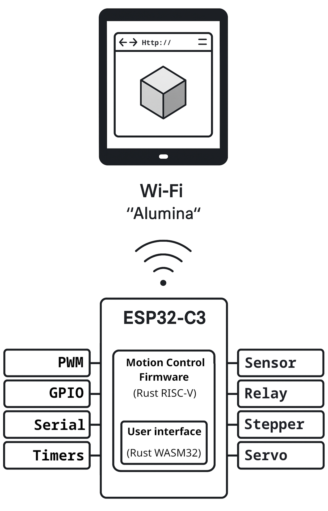
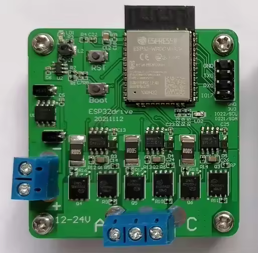
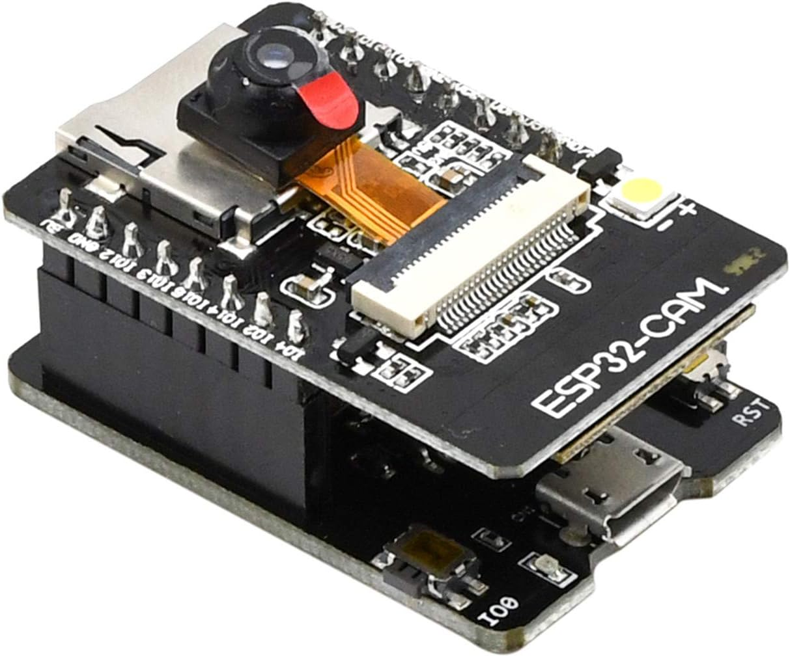

# Alumina Firmware

Alumina is an integrated CAD/CAM, physics simulation, and motion control solution written entirely in Rust.  It is intended to control laser and plasma cutters, 3D printers, CNC routers and mills, and lathes.

Try the [Alumina Interface Web Demo](https://timschmidt.github.io/alumina-interface/)

Firmware and UI get linked together at compile time and fit in the onboard flash of a single microcontroller, reducing design complexity, part count, and cost.
 - [Alumina Firmware](https://github.com/timschmidt/alumina-firmware)
   - targets the xtensa and risc-v esp32 microcontrollers
   - sets up a Wifi AP called "Alumina"
   - serves the Alumina UI via HTTP
   - responds to commands from the Alumina UI via HTTP
   - performs motion planning and step generation
   - (planned) port to [embassy](https://embassy.dev/) and [FoA](https://github.com/esp32-open-mac/FoA) and [smol](https://github.com/smol-rs/smol/blob/master/examples/simple-server.rs)
   - (planned) port to other embassy hardware targets
 - [Alumina Interface](https://github.com/timschmidt/alumina-interface)
   - targets [WebAssembly](https://en.wikipedia.org/wiki/WebAssembly)
   - draws geometry using WebGL and egui
   - works in any browser, desktop or mobile
   - CAD using [csgrs](https://github.com/timschmidt/csgrs) and [egui_node_graph2](https://github.com/trevyn/egui_node_graph2)
   - calculate and display 2D slices of 3D models
   - Communicates with Alumina Firmware to display diagnostic log, graph, and photo of the controller
   - Fits in < 4Mb microcontroller flash, including firmware
   - (planned) multiple controllers in sync
   - (planned) use [wgmath](https://wgmath.rs/) to move most CAD and geometry and toolpath calculation to the GPU

## Community
[](https://discord.gg/cCHRjpkPhQ)

## Hardware
### [MKS TinyBee](https://github.com/makerbase-mks/MKS-TinyBee/)


### [Esp32Drive](https://www.aliexpress.us/item/3256804594508948.html)


### [Esp32Cam](https://github.com/raphaelbs/esp32-cam-ai-thinker)


### [PD-Stepper](https://github.com/joshr120/PD-Stepper)
### [Esp-drone](https://github.com/espressif/esp-drone)
### [Fugu MPPT](https://www.instructables.com/DIY-1kW-MPPT-Solar-Charge-Controller/)
### [Spotify Neopixel Visualizer](https://github.com/0xjmux/iot_leddriver_hw)

## HTTP API
```
/						GET index.html
/alumina-ui.js			GET alumina-ui.js
/alumina-ui.html		GET alumina-ui.html.gz
/alumina-ui_bg.wasm		GET alumina-ui_bg.wasm.br
/favicon.ico			GET favaicon.gif
/time					GET 
/files					POST 
/queue					GET, POST 
/board					GET json: {{"name":"{}","image_mime":"{}","image_url":"/board/image"}}
/board/image			GET PNG formatted board image
```

## Development
### Build and flash firmware
```shell
cargo install espup
espup install
export IDF_PATH="~/.espressif/esp-idf/v5.4.1/"

cargo run --release --features="device_mks_tinybee"
```

to flash devices which make use of a ch340 USB serial adapter you must modify ~/.config/espflash.toml like so:

```toml
[connection]
# esp32-c3
#serial = "/dev/ttyACM0"
# ch340 + esp32-c3
serial = "/dev/ttyUSB0"

# esp32-c3
#[[usb_device]]
#vid = "303a"
#pid = "1001"

# ch340 + esp32-c3
[[usb_device]] 
vid="1a86"
pid="7523"
```

## Todo
- BLE support
- flesh out wifi scan / connect and nvs support
- get motion control working
- klipper style multi-mcu support
- get endstops and homing working
- implement sd card support
- data logging (from IMU, temp/humid, received commands) to SD available space
- add internet cloud to diagram animation
- crunch board graphics and link at compile time for diagnostics tab
- bus pirate features
- support http://wiki.fluidnc.com/en/hardware/existing_hardware
- FoC Servo support
- MPPT
- Active Rectification support
- PID / bang-bang heater control
- rename board to device
- rename to Alumina Interface / Alumina Device
- consider implementing commands similar to https://github.com/simplefoc/Arduino-FOC/blob/master/src/communication/commands.h
