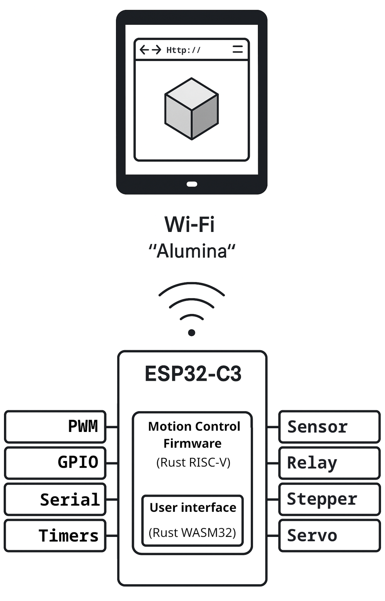

# Alumina Firmware

Alumina Firmware is the ESP32 controller prototype for the Alumina CAD/CAM and
machine-control system. It starts a Wi-Fi access point, embeds and serves the
[Alumina Interface](https://github.com/timschmidt/alumina-interface), exposes
diagnostic GPIO and device metadata over HTTP, and contains the first motion-
planning and step-execution types.

[Try the browser-only Alumina Interface demo](https://timschmidt.github.io/alumina-interface/).



## Current status

The firmware currently targets classic Xtensa ESP32 devices through ESP-IDF
5.4.1. It is an early hardware prototype, not production machine-control
firmware: the HTTP UI and GPIO diagnostics run, while hardware-timed stepping,
homing, endstops, persistent command storage, and Wi-Fi provisioning remain to
be implemented. The default `Alumina` access point is open and its control API
is unauthenticated, so use it only on an isolated development network.

Exactly one controller feature must be enabled:

| Feature | Controller | Pin-map reference |
| --- | --- | --- |
| `device_mks_tinybee` | MKS TinyBee | [Makerbase repository](https://github.com/makerbase-mks/MKS-TinyBee), [local schematic](<docs/MKS TinyBee V1.0_003 SCH.pdf>) |
| `device_xprov5` | CNC xPro V5 | [FluidNC hardware notes](https://wiki.fluidnc.com/en/hardware/3rd-party/xPro_V5) |
| `device_esp32drive` | ESP32Drive | [board listing](https://www.aliexpress.us/item/3256804594508948.html) |
| `device_esp32cam` | AI-Thinker ESP32-CAM | [pin-map repository](https://github.com/raphaelbs/esp32-cam-ai-thinker) |

The feature currently selects [`Device`](src/devices/mod.rs) metadata, its
diagnostic image, and a pin-map module. The active HTTP GPIO prototype still
uses the fixed ESP32-WROOM mapping below; selecting a board does not yet wire
its pin constants into motion control.

| UI label | ESP32 GPIO | Current role |
| --- | ---: | --- |
| D0 | 2 | General output |
| D1 | 23 | General output and active-low relay |
| D3 | 4 | General output |
| D4 | 5 | General output |
| D5 | 16 | General output |
| D6 | 17 | General output |
| D7 | 18 | General output |
| D12 | 19 | Status output |

## Build and flash

Install the Espressif Rust toolchain and flashing tools, then load the shell
environment created by `espup`:

```sh
cargo install espup espflash ldproxy
espup install
source "$HOME/export-esp.sh"
```

The firmware embeds compressed artifacts from a sibling `alumina-interface`
checkout. Build those assets first; the post-build hook needs `gzip`,
`wasm-opt`, `wasm-tools`, and `brotli` to produce every required file.

```sh
cd ../alumina-interface
rustup target add wasm32-unknown-unknown
cargo install trunk wasm-opt wasm-tools
trunk build --release

cd ../alumina-firmware
cargo run --release --features device_mks_tinybee
```

Replace `device_mks_tinybee` with one other feature from the table. The Cargo
runner invokes `espflash flash`; use `espflash` configuration or its CLI options
to select a serial port when automatic discovery is ambiguous.

## Firmware structure

- [`Planner`](src/planner.rs) owns a fixed-capacity ring of motion [`Block`](src/commandbuffer.rs)
  values. `Planner::buffer_line` converts axis coordinates to steps and
  `Planner::recalculate_trapezoids` derives the prototype velocity profiles.
- [`Block::calculate_trapezoid`](src/commandbuffer.rs) records acceleration,
  plateau, and deceleration boundaries. The current planner stops at every
  block and does not yet perform junction look-ahead.
- [`Stepper`](src/interrupts.rs) tracks software progress through one block. It
  does not yet schedule an ESP-IDF timer or emit physical step pulses.
- [`Device`](src/devices/mod.rs) exposes the selected board's stable name,
  display name, image bytes, and MIME type.
- [`start_access_point`](src/main.rs) configures the firmware's SoftAP before
  the HTTP handlers are registered.

## HTTP API

| Endpoint | Method | Result |
| --- | --- | --- |
| `/` | GET | Embedded interface HTML |
| `/alumina-ui.js` | GET | Gzip-compressed JavaScript loader |
| `/alumina-ui_bg.wasm` | GET | Brotli-compressed WebAssembly module |
| `/favicon.ico` | GET | Interface icon |
| `/device` | GET | JSON device name, display name, image MIME type, and image URL |
| `/device/image` | GET | Embedded image for the selected controller |
| `/time` | GET | Monotonic milliseconds since boot |
| `/pins` | GET | JSON snapshot of the output latches listed above |
| `/files` | POST | Number of request-body bytes received; storage is not implemented |
| `/queue` | GET | Placeholder queue representation |
| `/queue` | POST | One plain-text command |

`POST /queue` accepts `status_on`, `status_off`, `relay_on`, `relay_off`, and
`dN_high`/`dN_low` for D0, D1, and D3 through D7. It also accepts a prototype
rapid move such as `g0 x10 y0 z0 f1500`. `scan_wifi` and `set_wifi` are reserved
but return `501 Not Implemented`.

## References

- The [Rust on ESP Book](https://docs.esp-rs.org/book/) covers the toolchain,
  ESP-IDF workflow, and flashing setup.
- [`esp-idf-hal`](https://docs.esp-rs.org/esp-idf-hal/),
  [`esp-idf-svc`](https://docs.esp-rs.org/esp-idf-svc/), and
  [`embedded-svc`](https://docs.rs/embedded-svc/) provide the hardware, Wi-Fi,
  HTTP, and service abstractions used here.
- [`esp-idf-sys`](https://github.com/esp-rs/esp-idf-sys) builds and links the
  pinned ESP-IDF release; [`embuild`](https://github.com/esp-rs/embuild) carries
  its configuration through Cargo. The build script works around
  [Cargo issue 9641](https://github.com/rust-lang/cargo/issues/9641).
- [`espflash`](https://github.com/esp-rs/espflash) flashes and monitors ESP32
  targets. [Trunk](https://trunkrs.dev/) builds the embedded WebAssembly UI.
- The repository includes the [PCF8575 data sheet](docs/PCF8575.pdf) used by the
  TinyBee virtual-pin map and additional ESP32-C3/XIAO reference material under
  [`docs/`](docs/).

Related projects: [Alumina Interface](https://github.com/timschmidt/alumina-interface)
provides the browser UI, and [csgrs](https://github.com/timschmidt/csgrs)
provides its constructive-solid-geometry and mesh operations.

Community: [Discord](https://discord.gg/cCHRjpkPhQ)

License: [MIT](LICENSE)
